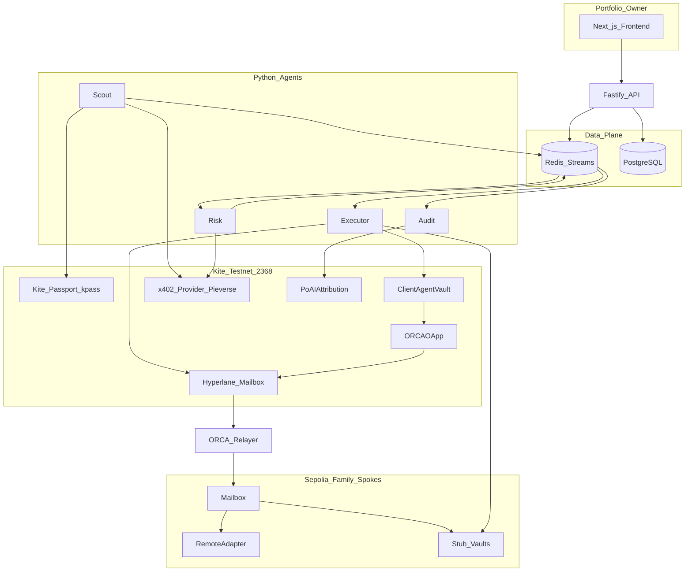
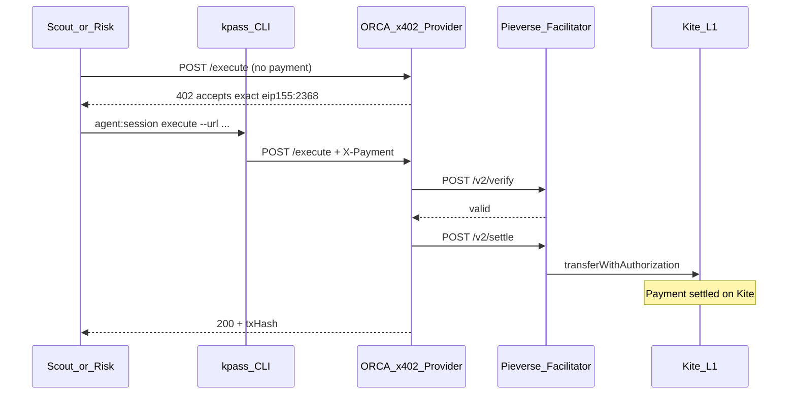
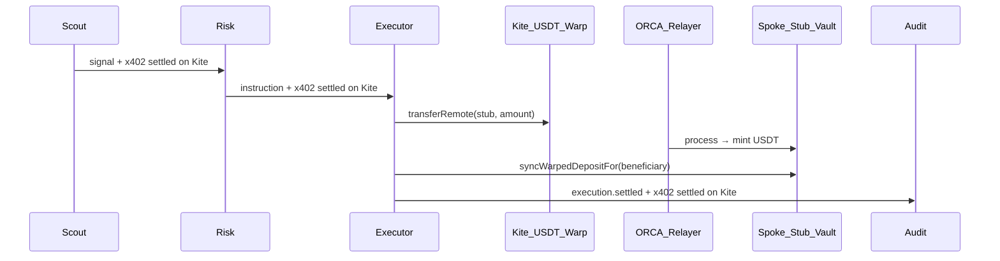
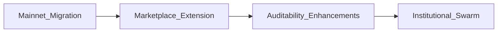

# ORCA

## On-chain Risk Coordination Architecture

**A decentralized swarm of credentialed AI agents that collaboratively manage cross-chain DeFi yield — with every inter-agent payment settled on Kite, cross-chain collateral moved via Hyperlane, and attribution recorded on-chain.**

---
<!-- TOC -->
## Table of Contents

- [Executive Summary](#executive-summary)
- [Run locally](#run-locally)
- [Important Links](#important-links)
- [Introduction](#introduction)
- [The Problem We Solve](#the-problem-we-solve)
- [Example User: Maya and the Yield Gap](#example-user-maya-and-the-yield-gap)
- [Technology Stack](#technology-stack)
- [System Architecture](#system-architecture)
- [The Four Agents](#the-four-agents)
- [Complete Pipeline Flow](#complete-pipeline-flow)
- [Kite AI Integrations](#kite-ai-integrations)
- [x402 Module — How Agent Payments Are Settled on Kite](#x402-module--how-agent-payments-are-settled-on-kite)
- [Hyperlane Integration — Architecture and Innovation](#hyperlane-integration--architecture-and-innovation)
- [Scout Marketplace](#scout-marketplace)
- [Product Roadmap](#product-roadmap)
- [Smart Contracts — Deep Dive](#smart-contracts--deep-dive)
- [Conclusion](#conclusion)

---

## Executive Summary

**ORCA (On-chain Risk Coordination Architecture)** replaces opaque, monolithic DeFi bots with a **transparent four-agent pipeline** — Scout, Risk, Executor, and Audit — each with a **Kite Agent Passport DID**, programmatic spending limits, and **micropayments settled on Kite** via the **x402** protocol.

**Kite primitives we built on:**

- **Agent Passport** — DID identity, passkey-gated spending sessions, `kpass` CLI automation
- **x402 / AP2** — HTTP 402 challenges; **three** inter-agent payments per cycle (Scout→Risk, Risk→Executor, Executor→Audit), each **settled on Kite** via Pieverse facilitator (`eip155:2368`)
- **Account abstraction** — `ClientAgentVault` + `SpendingRuleEnforcer` enforce budgets and whitelisted targets on-chain
- **PoAI** — Audit agent records attributable actions for future reward distribution
- **Gasless stablecoin rails** — PIEUSD for marketplace purchases; USDT for yield collateral

**Hyperlane (our cross-chain innovation):**

We **extended Kite to Hyperlane**. Hyperlane was **not available for Kite** out of the box — no public relayer coverage, no validator ISM for domain **2368**, no indexed explorer path. We deployed core mailboxes, **four USDT** to four Sepolia-family spokes, hub `ORCAOApp` messaging, spoke `RemoteAdapter` + **NoopISM**, and an **in-repository relayer** so Kite could participate in Hyperlane messaging and bridging like any other chain.

> We believe deeply in this idea — it solves a real coordination problem we face managing cross-chain USD ourselves. **Mainnet deployment, real-protocol integrations, and production hardening require funded testnet→mainnet cycles.** If you can support grants or sponsorship for real-fund testing and mainnet launch, we would put every dollar toward audited contracts, validator ISMs, and 24/7 relayer ops.

## Run locally

To set up and run the **full stack** (Postgres, Redis, API, frontend, x402 provider, and all four agents on Kite testnet), use the step-by-step guide in **[setup.md](setup.md)**.

That document covers prerequisites, `.env` and JSON config files, `pnpm db:setup` and per-service commands
## Important Links

- Live demo: [https://orca-kite.vercel.app](https://orca-kite.vercel.app)
- Demo video: [https://www.youtube.com/watch?v=wFkcXo4mtok](https://www.youtube.com/watch?v=wFkcXo4mtok)
- Pitch deck: [https://www.canva.com/design/DAHJ_tHxJSA/5T-_xzNzx5AsoyCXZNdRXw/view?utm_content=DAHJ_tHxJSA&utm_campaign=designshare&utm_medium=link2&utm_source=uniquelinks&utlId=hec3dcc447d](https://www.canva.com/design/DAHJ_tHxJSA/5T-_xzNzx5AsoyCXZNdRXw/view?utm_content=DAHJ_tHxJSA&utm_campaign=designshare&utm_medium=link2&utm_source=uniquelinks&utlId=hec3dcc447d)

### Deployed Contracts (Kite Testnet)

Kite testnet (chain ID **2368**) has **13 ORCA-authored contracts** plus **Hyperlane protocol contracts** we deployed so Kite could bridge and message. Spoke chains (four Sepolia-family networks) each have **7 ORCA contracts** (NoopISM, RemoteAdapter, four stubs, synthetic USDT via warp) — see [Hyperlane Integration](#hyperlane-integration--architecture-and-innovation).

#### ORCA control plane — 9 contracts (`pnpm deploy` -> `kite-testnet.latest.json`)

| Contract | Address | Explorer |
|----------|---------|----------|
| ORCARegistry | `0x79F21CfDcdd463F9267e7fa37A5052Ea9aB0D6fe` | [Kitescan](https://testnet.kitescan.ai/address/0x79F21CfDcdd463F9267e7fa37A5052Ea9aB0D6fe) |
| SpendingRuleEnforcer | `0xa64DAF0613508F57a35E18F7b9240Fc171b85768` | [Kitescan](https://testnet.kitescan.ai/address/0xa64DAF0613508F57a35E18F7b9240Fc171b85768) |
| PoAIAttribution | `0xF2e85C0A2dcCdb2D55AB48Ee974aC57b30f9462E` | [Kitescan](https://testnet.kitescan.ai/address/0xF2e85C0A2dcCdb2D55AB48Ee974aC57b30f9462E) |
| LZBridgeGuard | `0x6D84Cecfc348738C5F44254A704881AA7b758ca7` | [Kitescan](https://testnet.kitescan.ai/address/0x6D84Cecfc348738C5F44254A704881AA7b758ca7) |
| ORCAOApp | `0x4BbD1962B86738c322DCB48dc34e5D6CD69de885` | [Kitescan](https://testnet.kitescan.ai/address/0x4BbD1962B86738c322DCB48dc34e5D6CD69de885) |
| RemoteAdapter (legacy hub) | `0xDfCC37F066Be769c9Ca328332dB0235EE629c739` | [Kitescan](https://testnet.kitescan.ai/address/0xDfCC37F066Be769c9Ca328332dB0235EE629c739) |
| x402ChannelManager | `0xCb55cd522586d908380962c3070b5f86Ad61e4fC` | [Kitescan](https://testnet.kitescan.ai/address/0xCb55cd522586d908380962c3070b5f86Ad61e4fC) |
| ClientAgentVault | `0x1bcdcf2acc93d01F7F66010BE7B5a647A7cfC40f` | [Kitescan](https://testnet.kitescan.ai/address/0x1bcdcf2acc93d01F7F66010BE7B5a647A7cfC40f) |
| ORCAMultisigTreasury | `0x4b3AEb7ae752827BeB6E5D46aF1Dfa589fE244D4` | [Kitescan](https://testnet.kitescan.ai/address/0x4b3AEb7ae752827BeB6E5D46aF1Dfa589fE244D4) |

#### ORCA Kite stub yield vaults — 4 contracts (`deploy-remote-stubs` -> `kiteTestnet.stubs.json`)

Used for hub-local `kite_deposit` execution and Scout ranking on Kite. Demo APY **500 bps**.

| Contract | Address | Explorer |
|----------|---------|----------|
| OrcaAaveV3StubVault | `0x8fa6465cBd56Ab4Af4127E02525e987a123A38B2` | [Kitescan](https://testnet.kitescan.ai/address/0x8fa6465cBd56Ab4Af4127E02525e987a123A38B2) |
| OrcaCompoundV3StubVault | `0x99e706c2BbAbB5D21B916f0A5aaA545DA8F4E979` | [Kitescan](https://testnet.kitescan.ai/address/0x99e706c2BbAbB5D21B916f0A5aaA545DA8F4E979) |
| OrcaMorphoBlueStubVault | `0x74e3bace8102F7D2bB5741aC301e6b062d5224B9` | [Kitescan](https://testnet.kitescan.ai/address/0x74e3bace8102F7D2bB5741aC301e6b062d5224B9) |
| OrcaUniswapV3StubVault | `0x67EF6ff3C021AD9e5f658C879774bEBd6ef1f4e7` | [Kitescan](https://testnet.kitescan.ai/address/0x67EF6ff3C021AD9e5f658C879774bEBd6ef1f4e7) |

**Artifacts:** [`contracts/deployments/kite-testnet.latest.json`](contracts/deployments/kite-testnet.latest.json) · [`contracts/deployments/kiteTestnet.stubs.json`](contracts/deployments/kiteTestnet.stubs.json) · [`hyperlane/outputs/snapshots/orca-integration.latest.json`](hyperlane/outputs/snapshots/orca-integration.latest.json)

### Agent Transactions From One Workflow Run

Signal ID: `8dbfe26a-33bb-4ec6-aabd-a1b683e79df9`

#### Scout Agent

- Signal published: [0x21fe4df260508741d796ded076799a9f89711ed11039a501cc924fb523874515](https://testnet.kitescan.ai/tx/0x21fe4df260508741d796ded076799a9f89711ed11039a501cc924fb523874515)
- Scout x402 payment event (Scout -> Risk): [0x0fe7d6c2e852a668ab867f6ede532a386f674c5088e448ac3bacf936d89cafc2](https://testnet.kitescan.ai/tx/0x0fe7d6c2e852a668ab867f6ede532a386f674c5088e448ac3bacf936d89cafc2)
- Scout PoAI attribution: [0x0b4fe2eb480d692d5b12ea6e86dcc6f45a57313ab31c4ae416b6f4814f7445e9](https://testnet.kitescan.ai/tx/0x0b4fe2eb480d692d5b12ea6e86dcc6f45a57313ab31c4ae416b6f4814f7445e9)

#### Risk Agent

- Risk x402 payment (Risk -> Executor): [0x6d99bbae3334497894600ad2cea3fa80b0437e6cbcf9ce7d699b4cef53286bfa](https://testnet.kitescan.ai/tx/0x6d99bbae3334497894600ad2cea3fa80b0437e6cbcf9ce7d699b4cef53286bfa)

#### Executor Agent

- Executor vault/warp execution: [0x21fe4df260508741d796ded076799a9f89711ed11039a501cc924fb523874515](https://testnet.kitescan.ai/tx/0x21fe4df260508741d796ded076799a9f89711ed11039a501cc924fb523874515)
- Executor x402 payment (Executor -> Audit): [0xb319ebad2c58dafb9936c3cc1f4f62c65ceac836bd151aed6d21bb73ba4105e5](https://testnet.kitescan.ai/tx/0xb319ebad2c58dafb9936c3cc1f4f62c65ceac836bd151aed6d21bb73ba4105e5)
- Spoke syncWarpedDepositFor on Base Sepolia: [0x13ffbaefe32e8b490f4b113d9d040d687cbe5ab8f1388745962b2bd829980f43](https://sepolia.basescan.org/tx/0x13ffbaefe32e8b490f4b113d9d040d687cbe5ab8f1388745962b2bd829980f43)
- Executor PoAI attribution: [0x6a935a4792d2713eb8658f452410f530535f9ff66d6418caa3294ccf51bc0a5f](https://testnet.kitescan.ai/tx/0x6a935a4792d2713eb8658f452410f530535f9ff66d6418caa3294ccf51bc0a5f)

#### Audit Agent

- Audit PoAI attribution #1: [0x529b9cadacf01c5f61f4a8fe903674106c57ec053d812a9fd3da3ceb774fe6a8](https://testnet.kitescan.ai/tx/0x529b9cadacf01c5f61f4a8fe903674106c57ec053d812a9fd3da3ceb774fe6a8)
- Audit PoAI attribution #2: [0x04f3fe5fce074cff7e52529fdd82f07b65d250aca332bf760f45bd9ca82ac307](https://testnet.kitescan.ai/tx/0x04f3fe5fce074cff7e52529fdd82f07b65d250aca332bf760f45bd9ca82ac307)
- Audit PoAI attribution #3: [0x273268e34b7b589517a40184c6c105229e8c6bb275d43ef9de1d26ab36533ed9](https://testnet.kitescan.ai/tx/0x273268e34b7b589517a40184c6c105229e8c6bb275d43ef9de1d26ab36533ed9)

#### A2A Micropayments (x402 Settlements)

- Scout -> Risk: [0x0fe7d6c2e852a668ab867f6ede532a386f674c5088e448ac3bacf936d89cafc2](https://testnet.kitescan.ai/tx/0x0fe7d6c2e852a668ab867f6ede532a386f674c5088e448ac3bacf936d89cafc2)
- Risk -> Executor: [0x6d99bbae3334497894600ad2cea3fa80b0437e6cbcf9ce7d699b4cef53286bfa](https://testnet.kitescan.ai/tx/0x6d99bbae3334497894600ad2cea3fa80b0437e6cbcf9ce7d699b4cef53286bfa)
- Executor -> Audit: [0xb319ebad2c58dafb9936c3cc1f4f62c65ceac836bd151aed6d21bb73ba4105e5](https://testnet.kitescan.ai/tx/0xb319ebad2c58dafb9936c3cc1f4f62c65ceac836bd151aed6d21bb73ba4105e5)

---

## Introduction

DeFi crossed **$4T+ TVL** in 2025, but **liquidation windows are 30–90 seconds** and yield differs materially across Ethereum, Arbitrum, Optimism, and Base. Humans cannot monitor every pool, compute bridge-adjusted net APY, and execute atomically. Monolithic bots lack accountability; DAOs are too slow; multi-agent systems have no identity or payment rail between specialists.

**ORCA** is the first protocol we know of that combines:

1. **Specialized agents** with verifiable DIDs
2. **On-chain spending rules** (not app-layer promises)
3. **Sub-cent inter-agent payments** settled on Kite
4. **Cross-chain execution** via Hyperlane warp + mailbox (replacing the original LayerZero design in this build)
5. **A permissionless Scout marketplace** so third parties can sell signals and get paid

The name reflects the product: **risk is coordinated on-chain**, not hidden inside a single black-box script.

Read the original thesis in [`docs/idea.md`](docs/idea.md).

---

## The Problem We Solve

DeFi treasuries are no longer single-chain spreadsheets. Yield on stablecoins drifts apart across Ethereum, Arbitrum, Optimism, Base, and hub networks — and the spread only matters if you can **price the bridge**, **move collateral**, and **land the deposit** before the opportunity closes. When markets stress, liquidation dynamics can force decisions in **30–90 seconds**; multisigs and manual ops still think in days.

What exists today does not match that reality. **Centralized bots** hide logic in one codebase and one operator. **DAOs** are accountable but too slow to defend a position in a fast market. **Monolithic “AI agents”** collapse discovery, risk, execution, and audit into a single process you cannot inspect, cannot pay piecemeal, and cannot reward fairly when something goes right. Cross-chain work still often means trusting opaque bridging and hoping the net APY math was done correctly.

The gap is coordination: **specialized agents that each own part of the risk picture** still cannot form a trustworthy economy. They cannot prove who they are, cannot settle micropayments per signal without gas destroying the model, cannot enforce spending limits in contracts instead of config files, and cannot leave an immutable trail from “who said what” to “what actually executed.” Until that exists, there is no real market for external scouts — only more black boxes.

ORCA is built for that gap — a four-agent pipeline on Kite with verifiable DIDs, on-chain vault rules, x402 handoffs **settled on Kite**, Hyperlane cross-chain execution, PoAI attribution, and a permissionless Scout marketplace.

| Pain | Without ORCA | With ORCA |
|------|--------------|-----------|
| Cross-chain yield | Manual tracking; bridge cost ignored | Scout ranks net APY; Executor warps and syncs position |
| Agent trust | Unknown operator | Passport DID, registry, PoAI, signed pipeline events |
| Agent payments | Too expensive on L1 | Scout→Risk→Executor→Audit x402, **settled on Kite** |
| Risk limits | Off-chain config | `SpendingRuleEnforcer` + vault whitelist; Risk re-checks live data |
| Signal market | No paid external alpha | Scout Marketplace (PIEUSD + stream binding) |

---

## Example User: Maya and the Yield Gap

**Maya** is a small-team treasury lead with **$500,000 USDC** split across Kite (hub), Ethereum Sepolia, and Base Sepolia test portfolios — mirroring how she will run mainnet USDC.

### Without ORCA

- **Blended APY ~2.1%** after idle cash and stale positions
- **~0.35–0.5% annualized** lost to bridge fees and operational delay when she occasionally rebalances manually
- **3–5 days** to notice a rate move, approve a multisig, bridge, and deposit
- No audit trail tying “who recommended what” to P&L

### With ORCA (one rebalance cycle)

Maya sets `SCOUT_CROSS_CHAIN_BENEFICIARY` to her wallet, approves Passport spending sessions for all four agents, and starts Scout, Risk, Executor, and Audit.

Each handoff in the pipeline triggers an **x402 micropayment settled on Kite** (PIEUSD via Pieverse facilitator in staging, or stub/synthetic hash in dev). One full cycle includes **three** such settlements:

| # | Agent | x402 payment (settled on Kite) | Chain-of-thought (abbreviated) | Outcome |
|---|-------|-------------------------------|-------------------------------|---------|
| 1 | **Scout** | **Scout → Risk** — pays Risk for signal delivery (`paymentTxHash` on `scout.signal.created`) | DefiLlama: Aave ETH stub **2.7%** vs Compound Base stub **4.2%**; bridge **~0.12% APY**; net delta **~1.38%** | Signed signal + `execution_intent` (warp to Base Compound stub) on Redis |
| 2 | **Risk** | **Risk → Executor** — pays Executor when publishing the instruction (`paymentTxHash` on `risk.instruction.created`) | Live markets OK; drift **8 bps** < 50 bps cap; preflight true; confidence **0.84** | Approved instruction forwarded to Executor stream |
| 3 | **Executor** | **Executor → Audit** — pays Audit when publishing `execution.settled` (after on-chain work) | `warp_to_stub` to **84532**; ORCA relayer delivers warp; `syncWarpedDepositFor(Maya)` | **$500k** principal on Base stub; execution tx + settlement event |
| 4 | **Executor** | *(cross-chain collateral, not x402)* | Hyperlane USDT warp Kite → Base; relayer `process` on spoke mailbox | Synthetic USDT minted to stub; principal synced to Maya’s wallet |
| 5 | **Audit** | *(no outbound x402; receives Executor payment)* | PoAI `value_delta=10`; cites signal id + all three payment tx hashes | `recordAction` on Kite attribution ledger |

**Payment rail summary:** Scout pays Risk → Risk pays Executor → Executor pays Audit. All three transfers use the same x402 provider (`POST /execute` → 402 → `X-Payment` → Pieverse **settle** on Kite testnet). Audit does not pay a fourth agent; it records PoAI and deliberation to close the loop.

---

## Technology Stack

| Layer | Technology | Role |
|-------|------------|------|
| Frontend | Next.js 14, React, Tailwind, wagmi, Privy | Owner dashboard, marketplace, signals / chain-of-thought UI |
| API | Node.js, Fastify, Prisma, PostgreSQL, Redis | REST, WebSockets, stream ingest, scout marketplace |
| Agents | Python 3.11, Groq LLM, web3.py, httpx | Scout, Risk, Executor, Audit runtimes |
| Contracts | Solidity 0.8.24, Hardhat | Vault, OApp, stubs, PoAI, x402 channel manager |
| Cross-chain | Hyperlane Mailbox + Warp Routes | USDT collateral; custom relayer + NoopISM |
| Payments | x402, Pieverse facilitator, `kpass` | Agent micropayments **settled on Kite** |
| Indexing | Goldsky (optional), DefiLlama | Yield and utilization data |
| Monorepo | pnpm workspaces | `frontend`, `api`, `agents`, `contracts`, `services/x402-provider` |

---

## System Architecture

---

## The Four Agents

Each agent has a **Kite Passport DID**, private key, Groq **LLM deliberation** (reasoning_steps → verdict → verdict_summary), and Redis stream contracts.

### Scout Agent (`orca_scout`)

**Job:** Find the best risk-adjusted yield opportunity and broadcast a signed signal.

| Component | Source | Data used for |
|-----------|--------|----------------|
| **Yield scanner** | [DefiLlama](https://defillama.com/) API (`DEFILLAMA_*`) | Pool APY, TVL, chain/protocol identity |
| **Protocol enrichers** | Aave / Compound / Morpho / Uniswap data APIs (optional URLs in `.env`) | Utilization, caps — feeds ranker and Risk preflight |
| **Bridge cost estimator** | Optional bridge fee API or **0** if unset | Deducts annualized bridge cost from net APY |
| **Opportunity ranker + LLM selector** | Groq | Picks best candidate with `reasoning_steps` |
| **Signal broadcaster** | Redis + x402 provider | Publishes signal; **Scout → Risk** payment **settled on Kite** |
| **Passport signer** | `kpass` CLI | Session create/list; DID signing |
| **PoAI reporter** | `PoAIAttribution` on Kite | Optional scout attribution tx |
| **Execution intent builder** | Hyperlane integration snapshot + stub manifest | `warp_to_stub` metadata, dispatch fee quotes, `HYP_TRUSTED_REMOTES` |

Scout run proof links:
- Signal publish tx: [0x21fe4df260508741d796ded076799a9f89711ed11039a501cc924fb523874515](https://testnet.kitescan.ai/tx/0x21fe4df260508741d796ded076799a9f89711ed11039a501cc924fb523874515)
- Scout -> Risk x402 settle tx: [0x0fe7d6c2e852a668ab867f6ede532a386f674c5088e448ac3bacf936d89cafc2](https://testnet.kitescan.ai/tx/0x0fe7d6c2e852a668ab867f6ede532a386f674c5088e448ac3bacf936d89cafc2)
- Scout PoAI tx: [0x0b4fe2eb480d692d5b12ea6e86dcc6f45a57313ab31c4ae416b6f4814f7445e9](https://testnet.kitescan.ai/tx/0x0b4fe2eb480d692d5b12ea6e86dcc6f45a57313ab31c4ae416b6f4814f7445e9)

### Risk Agent (`orca_risk`)

**Job:** Independently re-validate Scout’s claim; approve or reject; forward instruction to Executor.

| Input | Source | Purpose |
|-------|--------|---------|
| Scout signal | Redis `orca:signals:scout` | Claimed route, APY delta, execution_intent |
| Live markets | DefiLlama + enrichers (re-fetch) | Fresh APY/TVL/utilization |
| Drift check | Internal | `apy_drift_bps` vs `max_apy_drift_bps` |
| API context | `GET /internal/risk-context` | Portfolio, registry, policy snapshot |
| Registry | `ORCARegistry` on Kite RPC | Scout active / DID allowlist |
| LLM | Groq | Structured approve/reject with citations |

On every instruction (approve or reject), pays **Executor** via x402 (`Risk → Executor`, **settled on Kite**) before publishing to `orca:risk:instructions`. `DEMO_MODE=true` auto-approves for demos only.

Risk run proof links:
- Risk -> Executor x402 settle tx: [0x6d99bbae3334497894600ad2cea3fa80b0437e6cbcf9ce7d699b4cef53286bfa](https://testnet.kitescan.ai/tx/0x6d99bbae3334497894600ad2cea3fa80b0437e6cbcf9ce7d699b4cef53286bfa)

### Executor Agent (`orca_executor`)

**Job:** Execute approved instructions on-chain.

| Path | When | Actions |
|------|------|---------|
| `kite_deposit` | Destination chain **2368** | Vault execute → stub on Kite |
| **`warp_to_stub`** (default) | Spoke chain IDs 11155111, 421614, 11155420, 84532 | Hardhat `transferRemote` USDT → stub address → relayer mint → `syncWarpedDepositFor(beneficiary)` |
| `hub_bridge_then_vault` | `EXECUTOR_CROSS_CHAIN_MODE=mailbox_oapp` | OApp dispatch → RemoteAdapter `depositFor` |
| `abort` | Invalid intent | No-op with reason |

After on-chain execution, publishes `execution.settled` and pays **Audit** via x402 (`Executor → Audit`, **settled on Kite**). API ingests the event for the dashboard. Optional `EXECUTOR_SUBMIT_VAULT_TX` for vault calldata submission.

Executor run proof links:
- Executor vault/warp tx: [0x21fe4df260508741d796ded076799a9f89711ed11039a501cc924fb523874515](https://testnet.kitescan.ai/tx/0x21fe4df260508741d796ded076799a9f89711ed11039a501cc924fb523874515)
- Executor -> Audit x402 settle tx: [0xb319ebad2c58dafb9936c3cc1f4f62c65ceac836bd151aed6d21bb73ba4105e5](https://testnet.kitescan.ai/tx/0xb319ebad2c58dafb9936c3cc1f4f62c65ceac836bd151aed6d21bb73ba4105e5)
- Spoke sync tx (Base Sepolia): [0x13ffbaefe32e8b490f4b113d9d040d687cbe5ab8f1388745962b2bd829980f43](https://sepolia.basescan.org/tx/0x13ffbaefe32e8b490f4b113d9d040d687cbe5ab8f1388745962b2bd829980f43)
- Executor PoAI tx: [0x6a935a4792d2713eb8658f452410f530535f9ff66d6418caa3294ccf51bc0a5f](https://testnet.kitescan.ai/tx/0x6a935a4792d2713eb8658f452410f530535f9ff66d6418caa3294ccf51bc0a5f)

### Audit Agent (`orca_audit`)

**Job:** Listen to scout, risk, and execution streams; score contribution; write **PoAI** `recordAction` on Kite.

| Stream | Event |
|--------|-------|
| `orca:signals:scout` | Signal quality |
| `orca:risk:instructions` | Approval/rejection |
| `orca:executions` | Success/failure, settlement tx |

LLM assigns `value_delta` ∈ {-20, -5, 5, 10, 20} for attribution economics.

Audit run proof links:
- Audit PoAI tx #1: [0x529b9cadacf01c5f61f4a8fe903674106c57ec053d812a9fd3da3ceb774fe6a8](https://testnet.kitescan.ai/tx/0x529b9cadacf01c5f61f4a8fe903674106c57ec053d812a9fd3da3ceb774fe6a8)
- Audit PoAI tx #2: [0x04f3fe5fce074cff7e52529fdd82f07b65d250aca332bf760f45bd9ca82ac307](https://testnet.kitescan.ai/tx/0x04f3fe5fce074cff7e52529fdd82f07b65d250aca332bf760f45bd9ca82ac307)
- Audit PoAI tx #3: [0x273268e34b7b589517a40184c6c105229e8c6bb275d43ef9de1d26ab36533ed9](https://testnet.kitescan.ai/tx/0x273268e34b7b589517a40184c6c105229e8c6bb275d43ef9de1d26ab36533ed9)

---

## Complete Pipeline Flow

### Phase 1 — Discovery and signal (Scout)

Run tx reference: [0x21fe4df260508741d796ded076799a9f89711ed11039a501cc924fb523874515](https://testnet.kitescan.ai/tx/0x21fe4df260508741d796ded076799a9f89711ed11039a501cc924fb523874515) and Scout -> Risk x402 settle [0x0fe7d6c2e852a668ab867f6ede532a386f674c5088e448ac3bacf936d89cafc2](https://testnet.kitescan.ai/tx/0x0fe7d6c2e852a668ab867f6ede532a386f674c5088e448ac3bacf936d89cafc2).

1. **Scan** — Query DefiLlama (hybrid mode) across allowed chains/protocols.
2. **Enrich** — Attach utilization from protocol APIs where configured.
3. **Bridge adjust** — Subtract annualized bridge fee estimate.
4. **Rank + LLM select** — Groq picks one candidate with numbered `reasoning_steps`.
5. **Build execution intent** — Hyperlane route metadata, stub addresses from `agents/config/orca-stub-protocols.json`.
6. **Sign** — EIP-712 / DID message on signal payload.
7. **Pay Risk** — x402 `POST` to `/execute` → 402 → `X-Payment` → **settled on Kite** via Pieverse (or stub).
8. **Broadcast** — `XADD` to Redis (`orca:signals:scout` or buyer-bound stream in marketplace mode).
9. **PoAI** — Optional scout attribution tx.

### Phase 2 — Risk gate (Risk)

Run tx reference: Risk -> Executor x402 settle [0x6d99bbae3334497894600ad2cea3fa80b0437e6cbcf9ce7d699b4cef53286bfa](https://testnet.kitescan.ai/tx/0x6d99bbae3334497894600ad2cea3fa80b0437e6cbcf9ce7d699b4cef53286bfa).

1. **Consume** signal from Redis (new messages only).
2. **Rebuild evidence** — `RiskContextBuilder`: live markets, drift, preflight booleans.
3. **LLM verdict** — Approve only if preflight passes (production); demo mode overrides.
4. **Sign instruction** — Risk instruction event for Executor.
5. **Pay / authorize** next hop via x402 where configured.
6. **Publish** — `orca:risk:instructions`.

### Phase 3 — Execution (Executor)

Run tx references: hub execution [0x21fe4df260508741d796ded076799a9f89711ed11039a501cc924fb523874515](https://testnet.kitescan.ai/tx/0x21fe4df260508741d796ded076799a9f89711ed11039a501cc924fb523874515), spoke sync [0x13ffbaefe32e8b490f4b113d9d040d687cbe5ab8f1388745962b2bd829980f43](https://sepolia.basescan.org/tx/0x13ffbaefe32e8b490f4b113d9d040d687cbe5ab8f1388745962b2bd829980f43), Executor -> Audit x402 settle [0xb319ebad2c58dafb9936c3cc1f4f62c65ceac836bd151aed6d21bb73ba4105e5](https://testnet.kitescan.ai/tx/0xb319ebad2c58dafb9936c3cc1f4f62c65ceac836bd151aed6d21bb73ba4105e5).

1. **Consume** approved instruction.
2. **Preflight** — Spoke RPC map, relayer enabled, beneficiary set.
3. **Execute** — Hub warp and vault transaction; wait `EXECUTOR_BRIDGE_WAIT_SECONDS`.
4. **Sync principal** — `syncWarpedDepositFor` on spoke stub for owner wallet.
5. **Settle** — Publish execution record; micropayments **settled on Kite** where applicable.
6. **PoAI** — Record execution action.

### Phase 4 — Attribution (Audit)

Run tx references: Executor PoAI [0x6a935a4792d2713eb8658f452410f530535f9ff66d6418caa3294ccf51bc0a5f](https://testnet.kitescan.ai/tx/0x6a935a4792d2713eb8658f452410f530535f9ff66d6418caa3294ccf51bc0a5f), Audit PoAI [0x529b9cadacf01c5f61f4a8fe903674106c57ec053d812a9fd3da3ceb774fe6a8](https://testnet.kitescan.ai/tx/0x529b9cadacf01c5f61f4a8fe903674106c57ec053d812a9fd3da3ceb774fe6a8), [0x04f3fe5fce074cff7e52529fdd82f07b65d250aca332bf760f45bd9ca82ac307](https://testnet.kitescan.ai/tx/0x04f3fe5fce074cff7e52529fdd82f07b65d250aca332bf760f45bd9ca82ac307), [0x273268e34b7b589517a40184c6c105229e8c6bb275d43ef9de1d26ab36533ed9](https://testnet.kitescan.ai/tx/0x273268e34b7b589517a40184c6c105229e8c6bb275d43ef9de1d26ab36533ed9).

1. **Observe** all stream events.
2. **LLM audit** — Anomalies, value_delta.
3. **PoAI on-chain** — Permanent attribution ledger on Kite.
4. **API** — `POST /internal/agent-deliberation` persists chain-of-thought for UI.

### Phase 5 — Owner visibility (Frontend + API)

- WebSocket: `signal.created`, `risk.decision`, **`execution.settled`**, alerts
- Portfolio: `claimableOf` / stub principal by `?wallet=`
- Signals page: full agent reasoning timeline

Detailed operator steps: [`contracts/AGENTIC_FLOW.md`](contracts/AGENTIC_FLOW.md).

---

## Kite AI Integrations

### KM-01 — Agent Passport (DID)

- Each agent: `kpass user create --agent-type <scout|risk|executor|audit>`
- Spending sessions: budget, TTL, approved assets (**PIEUSD** for x402/marketplace)
- Non-interactive JSON: `--output json --no-interactive` in all agent automation
- Selective disclosure model: agent proves membership in owner’s fleet without revealing owner identity on-chain

**Code:** `agents/src/orca_scout/integrations/passport_cli.py`, `services/passport_signer.py`

### KM-02 — Account Abstraction (`ClientAgentVault`)

- UUPS-style vault; only **executor** may call `execute(target, value, data)`
- `SpendingRuleEnforcer` whitelists targets (`ORCAOApp`, stubs, etc.)
- Payable `execute` forwards native Kite for Hyperlane `mailbox.dispatch` fees
- Sync executor: `pnpm vault:sync-executor` if agent key ≠ on-chain executor

**Code:** `contracts/contracts/ClientAgentVault.sol`, `SpendingRuleEnforcer.sol`

### KM-03 — x402 state channels and micropayments

- On-chain primitive: `x402ChannelManager` (open/update/close channel records)
- Runtime: HTTP 402 + Passport session execute (see [x402 module](#x402-module--how-agent-payments-are-settled-on-kite))
- Per pipeline cycle: **Scout→Risk**, **Risk→Executor**, **Executor→Audit** — each **settled on Kite** (Pieverse `POST /v2/settle` or dev stub)

**Code:** `contracts/contracts/x402ChannelManager.sol`, `services/x402-provider/`

### KM-04 — Multisig treasury

- `ORCAMultisigTreasury` on Kite for protocol fees and epoch payouts (simplified deploy for hackathon)
- Production path: Ash 3-of-5 + TimelockGuard per [`docs/orcaDocs.md`](docs/orcaDocs.md)

### KM-05 — Cross-chain (Hyperlane)

- Hub domain **2368**; spokes: Sepolia, Arbitrum Sepolia, Optimism Sepolia, Base Sepolia
- See [Hyperlane section](#hyperlane-integration--architecture-and-innovation)

### KM-06 — PoAI attribution

- `PoAIAttribution.recordAction(agentDID, actionType, inputHash, outcomeHash, valueDelta)`
- Audit agent is primary writer; Scout/Executor may record when configured

---

## x402 Module — How Agent Payments Are Settled on Kite

ORCA implements the full **service provider** loop from Kite’s x402 docs, extended for **Pieverse facilitator v2** on chain id **2368**.

### Actors

| Actor | Role |
|-------|------|
| **Scout / Risk** | Passport agent with approved spending session |
| **x402-provider** (`services/x402-provider`) | Returns 402; verifies `X-Payment`; calls facilitator |
| **Pieverse** | `POST /v2/verify` + `POST /v2/settle` — executes transfer to `payTo` |
| **PIEUSD** | Test token `0x38129cf4CE5E183eFF248F42A7D345Bb1B47621A` |

### Payment flow (live staging)

### On-chain channel manager

`x402ChannelManager` tracks channel lifecycle (open → updates → close) and DID→signer mappings for future epoch netting. Agent runtime today uses HTTP x402 per call; channel close **settlement** on Kite is the production evolution path documented in requirements.

**Run locally:** `pnpm dev:x402-provider` — see [`services/x402-provider/README.md`](services/x402-provider/README.md).

---

## Hyperlane Integration — Architecture and Innovation

> Operator runbook and appendix: [`hyperlane/ORCA_Hyperlane_Integration.md`](hyperlane/ORCA_Hyperlane_Integration.md)

### Hyperlane was not available for Kite — we extended it

When ORCA started, **Kite testnet could not use Hyperlane the way established L1/L2 testnets do**:

- **No public Hyperlane relayer or explorer coverage** for Kite (domain **2368**) — a successful `transferRemote` on Kite did not imply balances on spokes without our own delivery path.
- **No validator set on default spoke ISMs for origin domain 2368** — destination `Mailbox.process` reverted with **`ISM verification failed`** until we deployed per-spoke **NoopISM** and wired warp routers (see [`hyperlane/fix.md`](hyperlane/fix.md)).
- **Kite was not a first-class Hyperlane hub** in public deployment registries — we ran `hyperlane core init` / `hyperlane core deploy` on Kite, enrolled warp routes, and committed **`hyperlane/outputs/snapshots/orca-integration.latest.json`** so agents and Hardhat share one canonical address book.

**We extended Kite to Hyperlane** — both **messaging** (hub `ORCAOApp` → spoke `RemoteAdapter`) and **bridging** (USDT HypCollateral on Kite → HypSynthetic on four spokes). ORCA treats Kite as the **settlement hub** (agent payments settled on Kite; collateral locked on Kite warps) while yield stubs run on Ethereum Sepolia, Arbitrum Sepolia, Optimism Sepolia, and Base Sepolia.

### Hub-and-spoke topology

| Role | Network | Hyperlane domain | Chain ID |
|------|---------|------------------|----------|
| **Hub** | Kite Testnet | **2368** | 2368 |
| **Spoke** | Ethereum Sepolia | 11155111 | 11155111 |
| **Spoke** | Arbitrum Sepolia | 421614 | 421614 |
| **Spoke** | Optimism Sepolia | 11155420 | 11155420 |
| **Spoke** | Base Sepolia | 84532 | 84532 |

### What we deployed and built

| Deliverable | Description |
|-------------|-------------|
| **Hyperlane core on Kite** | Mailbox + factory suite (validator announce, ISM factories, hooks, ICA router) |
| **Mailboxes on 5 chains** | Kite hub + four spoke testnets (see table below) |
| **4 warp route pairs** | 4× USDT (yield); hub HypCollateral → spoke HypSynthetic |
| **ORCA OApp layer** | `ORCAOApp` on Kite; `RemoteAdapter` + **NoopISM** on each spoke |
| **4 stub vaults × 4 spokes** | Aave V3, Compound V3, Morpho Blue, Uniswap V3 **labeled stubs** (hackathon simulation) |
| **In-repo relayer** | `contracts/relayer` — polls Kite `Dispatch`, calls `Mailbox.process` on spokes with empty metadata for NoopISM |
| **Trust wiring** | `pnpm hyperlane:wire-trust` — `trustedRemotes` = spoke **RemoteAdapter** (never warp router addresses) |
| **Integration artifact** | `orca-integration.latest.json` — mailboxes, routes, `HYP_TRUSTED_REMOTES` / `HYP_TRUSTED_SENDERS` |

### Three parallel cross-chain mechanisms

| Mechanism | Purpose |
|-----------|---------|
| **Warp routes** | Lock USDT on Kite; mint synthetic token on spoke via mailbox message + relayer `process` |
| **OApp mailbox** | `ORCAOApp.executeCrossChainRebalance` → spoke `RemoteAdapter.handle` (payload v2) |
| **Application accounting** | `syncWarpedDepositFor(beneficiary)` after warp mints to stub — ties portfolio API to user wallet |

**Default agent path:** `EXECUTOR_CROSS_CHAIN_MODE=warp_to_stub`

### Hyperlane Mailbox (all chains)

| Chain | Domain / chain ID | Mailbox |
|-------|-------------------|---------|
| **Kite Testnet** | 2368 | `0x0d5b681C5887617d68200B45F3947c99Cf402188` |
| **Ethereum Sepolia** | 11155111 | `0xCDF3D9c1E132e4b37A362CF0f11f384b673Aa908` |
| **Arbitrum Sepolia** | 421614 | `0x25f442fd07fc3eaC3a27F3E6AcaaBa0f15F3dbaD` |
| **Optimism Sepolia** | 11155420 | `0x0866f40D55E96b2D74995203Caff032aD81c14B0` |
| **Base Sepolia** | 84532 | `0x68e89453029DC14351bF72104dC30248BB766b69` |

### Kite testnet — Hyperlane core factory suite

Deployed with Hyperlane CLI; recorded in `hyperlane/registry/chains/kitetestnet/addresses.yaml`:

| Module | Address |
|--------|---------|
| Mailbox | `0x0d5b681C5887617d68200B45F3947c99Cf402188` |
| Validator announce | `0x077Dc8fd76e3E547aE52E538520c0621AACB22D0` |
| Proxy admin | `0x2c1f31d27645be47E0907D2eAa6A4f36F045BaE0` |
| Merkle tree hook | `0xd6Ea22b0932529F9B92A944a8c8A6d2b70af8aE2` |
| Domain routing ISM factory | `0xb09Adbd0CBFf2F62BAD98A6Ec46620E581A3831c` |
| Incremental domain routing ISM factory | `0x82602F0888a8ee5b276523daFE74b46FFc7e3051` |
| Static aggregation ISM factory | `0x5aDf80928f6f0Fa2C2D9Abb2FBf66e89557989bd` |
| Static merkle root multisig ISM factory | `0x71cA3A72aB0d4b9898674B78C474ED1325D6Dc0b` |
| Static message ID multisig ISM factory | `0xC420bA7e7c1115Ce46d460921f1ead58F0Ed7f69` |
| Static aggregation hook factory | `0x805651a9377DeC00F4e6b719db3aA5221536D1B9` |
| Interchain account router | `0xe6692b5e9a229E66569f3d94092ad301D1fE6B43` |
| Quoted calls | `0x385b53238468b5B453129B192aaAA1d869788885` |
| Test recipient | `0xc5E78532225B18e174FeCe089A854ac628179476` |

### USDT warp routes (yield / collateral)

Hub collateral: **`0x0fF5393387ad2f9f691FD6Fd28e07E3969e27e63`**

| Destination | Domain route | Kite HypCollateral router | Spoke HypSynthetic router |
|-------------|--------------|---------------------------|---------------------------|
| Ethereum Sepolia | 2368 → 11155111 | `0x6d67f572a72A1E4CDdDE3F4696E1e7550Ff6d5F1` | `0x9EC2e54cE40cb44D8986cbDDDB7B728272255C1A` |
| Arbitrum Sepolia | 2368 → 421614 | `0x2AA2a1264a5a19f7d14Bf8a806f1fdaa12F3E226` | `0xE3CcD4ec6E62b84Aeb4Db49FC50a2Ce9C11D2153` |
| Optimism Sepolia | 2368 → 11155420 | `0x755f38E41c4896239b1f43858d302ea3a265bd5c` | `0xdD416C32ebA6066c273d5083b1ACa227046Bb5c9` |
| Base Sepolia | 2368 → 84532 | `0xb0f59799fF2e5a2957185C84fD960a76E0A3c2Cc` | `0x2eD22aA87C87E4B0139552d50CB5B049E369C295` |

### ORCA hub contracts (Hyperlane-related, Kite)

| Contract | Address | Role |
|----------|---------|------|
| **ORCAOApp** | `0x4BbD1962B86738c322DCB48dc34e5D6CD69de885` | Dispatches rebalance messages to spoke RemoteAdapters |
| **ClientAgentVault** | `0x1bcdcf2acc93d01F7F66010BE7B5a647A7cfC40f` | Executor-only entry to OApp / stubs |
| **LZBridgeGuard** | `0x6D84Cecfc348738C5F44254A704881AA7b758ca7` | Threshold on large dispatches |
| **RemoteAdapter (legacy hub)** | `0xDfCC37F066Be769c9Ca328332dB0235EE629c739` | Early deploy; **production peers are per-spoke adapters below** |

**Trusted remotes (hub → spoke RemoteAdapter):**

| Spoke domain | RemoteAdapter |
|--------------|---------------|
| 11155111 (Ethereum Sepolia) | `0xa171fdeDC284Cfe3c0e00A808fCD427729C39a05` |
| 421614 (Arbitrum Sepolia) | `0x4e4D20D7bc954FDe4C447a21255B9eD39cfAb938` |
| 11155420 (Optimism Sepolia) | `0x583c17fDf9031ece81251eA2f8c819C84fE7f69d` |
| 84532 (Base Sepolia) | `0x8c1fC785b71A6a095878fB49BDdcb5788D553C2D` |

**Trusted sender (spoke → hub):** domain **2368** → ORCAOApp `0x4BbD1962B86738c322DCB48dc34e5D6CD69de885`

### Spoke stacks — all addresses (four chains × four protocol stubs)

Each spoke: **NoopISM**, **RemoteAdapter**, **synthetic USDT** (warp token = router underlying), and **four stub vaults**.

#### Ethereum Sepolia (11155111)

| Component | Address |
|-----------|---------|
| NoopISM | `0x0ffb0e6108d8B4a6Bbece0179C0103E82FF24b50` |
| RemoteAdapter | `0xa171fdeDC284Cfe3c0e00A808fCD427729C39a05` |
| Synthetic USDT | `0x9EC2e54cE40cb44D8986cbDDDB7B728272255C1A` |
| OrcaAaveV3StubVault | `0x7F5843821a7f6eF5DcAD2FDad1cc98D40397C79c` |
| OrcaCompoundV3StubVault | `0x07EF97588EB4C30ec40aA985F93aFb3D7BE9FF4B` |
| OrcaMorphoBlueStubVault | `0x70088f574e6fB6D5De14885E87220A56F184e7A4` |
| OrcaUniswapV3StubVault | `0x41f5e84299E024Cad7cF8E174E3443096ef06290` |

#### Arbitrum Sepolia (421614)

| Component | Address |
|-----------|---------|
| NoopISM | `0x0D5f07E21666E9B4621bf6507B670f41FB9BEE32` |
| RemoteAdapter | `0x4e4D20D7bc954FDe4C447a21255B9eD39cfAb938` |
| Synthetic USDT | `0xE3CcD4ec6E62b84Aeb4Db49FC50a2Ce9C11D2153` |
| OrcaAaveV3StubVault | `0xE3C5db3835d2ebA288a2A48A214Ec99a5D79eAf4` |
| OrcaCompoundV3StubVault | `0x2E14dE7c2325bc652bB2181dB75606FC32703611` |
| OrcaMorphoBlueStubVault | `0x704C280Feca5948c648a63b1C47e9A68705fE383` |
| OrcaUniswapV3StubVault | `0xE66c8987dd2276f002E93CDd17A17e60CD8BFE16` |

#### Optimism Sepolia (11155420)

| Component | Address |
|-----------|---------|
| NoopISM | `0xe33c7296173953C8376D14C7AA2D64Bb946a4644` |
| RemoteAdapter | `0x583c17fDf9031ece81251eA2f8c819C84fE7f69d` |
| Synthetic USDT | `0xdD416C32ebA6066c273d5083b1ACa227046Bb5c9` |
| OrcaAaveV3StubVault | `0xE51F813B95a5970257f1a68Ee599a91CBB201828` |
| OrcaCompoundV3StubVault | `0xC17A81c2C11d78A3b2Bc6E26C7A470307185821E` |
| OrcaMorphoBlueStubVault | `0x2d43aC514B55A308bC3b6479D6B66c7Bfa4e4c34` |
| OrcaUniswapV3StubVault | `0xEffB4586Cc973fF41Ff2777D5d571aEf31b300CA` |

#### Base Sepolia (84532)

| Component | Address |
|-----------|---------|
| NoopISM | `0x3b475B9543ceCe4C83D74D3Ed129904864362ECd` |
| RemoteAdapter | `0x8c1fC785b71A6a095878fB49BDdcb5788D553C2D` |
| Synthetic USDT | `0x2eD22aA87C87E4B0139552d50CB5B049E369C295` |
| OrcaAaveV3StubVault | `0xA2A1f407a2C2249c85D9d408f2d234ddB3e28A54` |
| OrcaCompoundV3StubVault | `0xA8b8b4aF5b4214131863Ff7865360cc7F331768D` |
| OrcaMorphoBlueStubVault | `0xa4712B6c695fDC4ECB3C9F21255492D7aF831e2f` |
| OrcaUniswapV3StubVault | `0x4d15c615909D8Ce7abB09f87f1813dA75160dC5c` |

Stub vaults use **500 bps** demo APY in deployment metadata. **Two-hop warp:** origin `transferRemote` on Kite only locks collateral; spoke balance appears after ORCA relayer `Mailbox.process`.

### End-to-end `warp_to_stub` flow

**Operator commands:** `pnpm relayer:start`, `pnpm hyperlane:wire-trust`, `pnpm e2e:orca-sepolia` — see [`contracts/AGENTIC_FLOW.md`](contracts/AGENTIC_FLOW.md).

---

## Scout Marketplace

The **permissionless Scout Marketplace** is one of ORCA’s most novel surfaces — a **real economic layer** for signal producers, not just internal agents.

### Why it matters

- **Anyone** can register a Scout DID, stake, and sell Redis stream access
- **Buyers** pay **PIEUSD on Kite** (payment **settled on Kite** on-chain)
- **Creators** run their own Scout runtime against **buyer-provided Redis** after binding
- Enables a **market for alpha** aligned with PoAI attribution and reputation scores

### Flow

1. **Register** — Owner signs typed data; API attests; `ScoutMarketplace` row (`did`, `vault`, `stakeUsdc`, `reputationScore`)
2. **List** — Appears on `/marketplace` UI
3. **Purchase quote** — `GET /scouts/:id/purchase-quote` → PIEUSD amount, recipient
4. **Confirm** — Buyer sends ERC-20 transfer; `POST .../purchase/confirm` verifies tx on Kite RPC
5. **Binding** — Buyer `PUT /scouts/purchases/:id/binding` with `redisUrl` + secret header
6. **Run** — Creator Scout uses `SCOUT_PURCHASE_ID` + `SCOUT_BINDING_SECRET`; signals flow to buyer’s stream
7. **Risk allowlist** — Buyer sets `RISK_SCOUT_DID_ALLOWLIST` for subscribed scout only

**Frontend:** [`frontend/src/app/marketplace/page.tsx`](frontend/src/app/marketplace/page.tsx)

**API:** [`api/src/routes/scouts.ts`](api/src/routes/scouts.ts), Prisma models `ScoutMarketplace`, `ScoutPurchase`

---

## Smart Contracts — Deep Dive

### Hub contracts (Kite testnet)

| Contract | Address | Role |
|----------|---------|------|
| **ORCARegistry** | `0x79F21CfDcdd463F9267e7fa37A5052Ea9aB0D6fe` | Agent registration, DID hash, active flags — marketplace staking |
| **SpendingRuleEnforcer** | `0xa64DAF0613508F57a35E18F7b9240Fc171b85768` | Time-window budget, per-tx cap, target whitelist for vault `execute` |
| **PoAIAttribution** | `0xF2e85C0A2dcCdb2D55AB48Ee974aC57b30f9462E` | Immutable action ledger; epoch reward hooks |
| **LZBridgeGuard** | `0x6D84Cecfc348738C5F44254A704881AA7b758ca7` | Threshold on large `ORCAOApp` dispatches (legacy LZ name; guards Hyperlane path) |
| **ORCAOApp** | `0x4BbD1962B86738c322DCB48dc34e5D6CD69de885` | Hub OApp: `executeCrossChainRebalance`, trusted remotes, payable dispatch fee quote |
| **ClientAgentVault** | `0x1bcdcf2acc93d01F7F66010BE7B5a647A7cfC40f` | Only executor; forwards calls to enforcer-approved targets |
| **x402ChannelManager** | `0xCb55cd522586d908380962c3070b5f86Ad61e4fC` | x402 channel state: open/update/close between DIDs |
| **ORCAMultisigTreasury** | `0x4b3AEb7ae752827BeB6E5D46aF1Dfa589fE244D4` | Treasury withdrawals, batch payouts |
| **RemoteAdapter (legacy hub)** | `0xDfCC37F066Be769c9Ca328332dB0235EE629c739` | Early adapter; production peers are **per-spoke** adapters |

### Kite stub yield vaults (hub-local deposits)

From [`contracts/deployments/kiteTestnet.stubs.json`](contracts/deployments/kiteTestnet.stubs.json) — separate deploy from `deploy-remote-stubs.ts` on Kite:

| Contract | Address | Role |
|----------|---------|------|
| **OrcaAaveV3StubVault** | `0x8fa6465cBd56Ab4Af4127E02525e987a123A38B2` | Aave-flavored stub on Kite |
| **OrcaCompoundV3StubVault** | `0x99e706c2BbAbB5D21B916f0A5aaA545DA8F4E979` | Compound-flavored stub on Kite |
| **OrcaMorphoBlueStubVault** | `0x74e3bace8102F7D2bB5741aC301e6b062d5224B9` | Morpho-flavored stub on Kite |
| **OrcaUniswapV3StubVault** | `0x67EF6ff3C021AD9e5f658C879774bEBd6ef1f4e7` | Uniswap-flavored stub on Kite |

### Spoke contracts (four chains)

Per-spoke **NoopISM**, **RemoteAdapter**, **synthetic USDT**, and **four protocol stub vaults** — full address tables are in [Hyperlane Integration](#hyperlane-integration--architecture-and-innovation) above and in [`hyperlane/ORCA_Hyperlane_Integration.md`](hyperlane/ORCA_Hyperlane_Integration.md) §6.

### Contract behaviors (detailed)

**ORCARegistry** — Maps agent DIDs to owners, vault addresses, stake, and active bit. Marketplace registration finalizes on-chain stake receipt verification.

**SpendingRuleEnforcer** — Enforces rolling window spend caps and allowed contract targets. Prevents Executor from calling arbitrary DeFi protocols outside policy.

**ClientAgentVault** — Single entry for agent execution; bubbles revert data; holds native Kite for dispatch fees.

**ORCAOApp** — Serializes payload v2; quotes `mailbox.quoteDispatch`; requires `msg.sender == executorVault`; deduplicates `executedPayloads`; integrates `LZBridgeGuard` for large amounts.

**RemoteAdapter** — `handle()` only from mailbox; checks `trustedSender` domain 2368 == hub OApp; pulls collateral from beneficiary; `depositFor` on target stub; exposes custom ISM.

**OrcaStubYieldVaultBase** — Demo yield accrual (~500 bps in metadata); `depositFor`, `withdraw`, `claimableOf`, **`syncWarpedDepositFor`** for warp accounting.

**x402ChannelManager** — Channel lifecycle and DID signer registry for future netting of agent payments **settled on Kite** at epoch close.

**PoAIAttribution** — Records action hashes and value deltas; funds reward distribution in full tokenomics (post-hackathon).

---

## Product Roadmap

ORCA’s testnet build proves the four-agent pipeline, Kite settlement, and Hyperlane bridging. The roadmap below is how we take that prototype to production and open the agent layer to external builders.

### 1. Mainnet Migration

Deploy ORCA on **Kite, Ethereum, Arbitrum, Base, and Optimism mainnet** with production-grade Hyperlane ISMs (replacing testnet NoopISM), public relayer/redundancy, and audited control-plane contracts.

**Yield surface:** Replace hackathon **stub vaults** with integrations to real yield protocols (Aave v3, Compound III, Morpho Blue, and related adapters) so Executor paths move real collateral, not demo `principalOf` simulation.

### 2. Marketplace Extension

The Scout Marketplace exists today ([`frontend/src/app/marketplace`](frontend/src/app/marketplace), [`api/src/routes/scouts.ts`](api/src/routes/scouts.ts)), but **listing, buying, and running a third-party scout is still operator-heavy**. That friction is why Marketplace Extension is a dedicated milestone.

**What builders and buyers face now:**

| Step | Today | Friction |
|------|--------|----------|
| **List a scout** | Wallet sign-in → typed-data attest → stake approve → `registerPermissionlessScout` on `ORCARegistry` → confirm tx in API | Many manual on-chain steps; creator must know DID, vault address, and stake flow |
| **Buy access** | PIEUSD `transfer` on Kite → paste tx hash → receive `bindingSecret` out-of-band | No subscription SKU; buyer configures infra by hand |
| **Connect pipeline** | Buyer `PUT /scouts/purchases/:id/binding` with **their own Redis URL**; set `RISK_SCOUT_DID_ALLOWLIST` in Risk `.env` | Buyer must host Redis and run Risk + Executor + Audit separately |
| **Run creator scout** | Creator sets `SCOUT_PURCHASE_ID`, `SCOUT_BINDING_SECRET`, `SCOUT_BINDING_API_BASE`; Scout **polls** binding until buyer’s Redis is ready | Creator runs `orca-scout` locally; no hosted runtime |
| **Earn** | Payment goes to listing `ownerAddress`; PoAI attribution is partial | No automated epoch revenue share tied to signal quality yet |

**What we will ship to make it work:**

- **One-click subscribe** — Purchase in the app provisions entitlements: auto-set Risk allowlist for the scout DID, optional managed Redis/stream (no buyer-supplied `redisUrl`), and a guided “start pipeline” flow for Risk / Executor / Audit.
- **Hosted scout runtime** — Creators can register a strategy profile and run signals on ORCA-managed infrastructure instead of cloning `agents/.env` and binding secrets by hand.
- **Developer SDK + listing wizard** — Register custom **Scout strategies** (ranking rules, data sources, chain allowlist) and **Risk models** (preflight templates, drift caps) via API/CLI; wrap today’s attest + registry flow into a single guided path.
- **Plugin interface** — Load third-party Scout/Risk modules as versioned packages with sandboxed config, so external developers can ship agents without forking the monorepo.
- **Creator economics** — Tie marketplace listings to **PoAI reputation** and epoch payouts (treasury/multisig batch) so registered agents earn from usage, not only the initial PIEUSD transfer.
- **Account graph** — Link `User` / wallet ↔ `ScoutPurchase` ↔ active pipeline in the API (called out as open in [`docs/ORCA-Pending-Implementation.md`](docs/ORCA-Pending-Implementation.md)) so the dashboard shows “my subscriptions” and health, not disconnected txs.

Goal: any developer can **list → get discovered → get paid → deliver signals into a buyer’s live ORCA stack**

### 3. Auditability Enhancements

Turn Audit + PoAI from a logging path into a **feedback loop** for the swarm.

- **Self-improving agents** — Use Audit scores and PoAI `value_delta` to adjust prompts, thresholds, and ranking weights over time (with owner opt-in and caps).
- **Attribution-linked rewards** — Epoch distribution from `PoAIAttribution` + multisig treasury for scouts/risk models with verified contribution history.
- **Richer audit surface** — UI and API views that tie each `execution.settled` back to scout reasoning, risk preflight flags, and payment tx hashes **settled on Kite**.

### 4. Institutional Swarm Infrastructure

Scale ORCA for **DAOs, funds, and protocols** that need many portfolios and policy templates on one coordination layer.

- Multi-tenant vaults, policy packs, and delegated Passport sessions per strategy.
- SLA monitoring, alerting, and circuit breakers integrated with treasury multisig / timelock paths.
- White-label agent coordination: same Scout → Risk → Executor → Audit contract, operator-branded frontends and compliance hooks.

---

## Conclusion

ORCA is our answer to a question the industry is only starting to ask: **how do specialized AI agents coordinate real money across chains without trusting a single operator?**

We built:

- A **four-agent pipeline** with transparent LLM reasoning
- **Kite-native identity and payments** — every micropayment **settled on Kite**
- **Hyperlane cross-chain** infrastructure we deployed and wired for **domain 2368**
- A **Scout Marketplace** that turns signal quality into a purchasable product
- **On-chain enforcement** via vaults, spending rules, and PoAI attribution

Redis streams move signals, the relayer delivers warp messages, the frontend shows chain-of-thought, and Pieverse **settles** agent payments on Kite testnet.

We use ORCA because we need it. With funding for audited mainnet deployment, real protocol adapters, and production ISMs, ORCA can become the coordination layer we want for our own USDC/USDT — and for every treasury that refuses to trust a single black-box bot.
