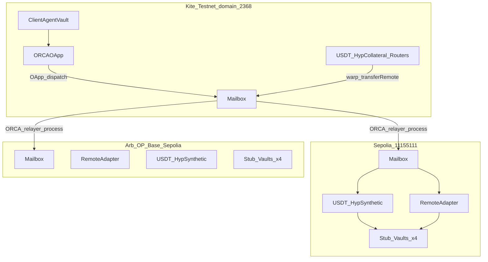
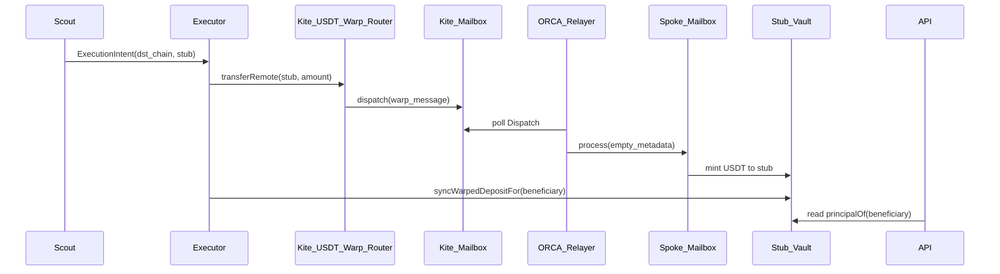
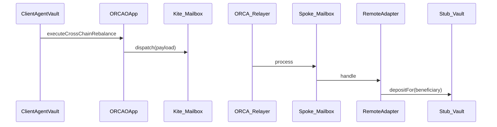

# ORCA Hyperlane Integration — Complete Reference

This document records everything ORCA (On-chain Risk Coordination Architecture) has achieved with [Hyperlane](https://docs.hyperlane.xyz/) on testnet: protocol core deployments, warp routes, custom application contracts, Noop interchain security module (ISM) integration, trust wiring, the in-repository relayer, and how agents and operators run cross-chain yield flows. It is synthesized from operator logs, deployment artifacts, integration snapshots, and application code in this repository. **Testnet addresses below are authoritative as of the committed `orca-integration.latest.json` and spoke deployment JSON files; always reconcile after redeploys.**

---

## Table of contents

1. [Executive summary and achievements](#1-executive-summary-and-achievements)
2. [Strategic context within ORCA](#2-strategic-context-within-orca)
3. [Network topology](#3-network-topology)
4. [Hyperlane core infrastructure](#4-hyperlane-core-infrastructure)
5. [Warp routes — complete inventory](#5-warp-routes--complete-inventory)
6. [ORCA application contracts](#6-orca-application-contracts)
7. [Noop ISM integration](#7-noop-ism-integration)
8. [Trust wiring and identity](#8-trust-wiring-and-identity)
9. [Custom ORCA relayer](#9-custom-orca-relayer)
10. [End-to-end flows](#10-end-to-end-flows)
11. [Agent and tooling integration](#11-agent-and-tooling-integration)
12. [Operator deployment timeline](#12-operator-deployment-timeline)
13. [Known limitations and production path](#13-known-limitations-and-production-path)
14. [Appendix](#14-appendix)

---

## 1. Executive summary and achievements

ORCA replaced LayerZero as its cross-chain transport layer with **Hyperlane Mailbox messaging** and **Hyperlane Warp Routes** for token bridging. The architecture uses a **hub-and-spoke** model:

| Role | Network | Hyperlane domain / chain ID |
|------|---------|----------------------------|
| **Hub** | Kite Testnet | **2368** |
| **Spoke** | Ethereum Sepolia | 11155111 |
| **Spoke** | Arbitrum Sepolia | 421614 |
| **Spoke** | Optimism Sepolia | 11155420 |
| **Spoke** | Base Sepolia | 84532 |

### What was delivered

- **Hyperlane core** (mailbox and protocol factories) deployed or confirmed on all five chains above.
- **Eight hub-to-spoke warp route pairs** in the integration snapshot: four for **USDT** (yield collateral) and four for **PIEUSD** (payments / x402 smoke only), each connecting Kite to one Sepolia-family spoke.
- **ORCA OApp stack on Kite**: `ORCAOApp` dispatches rebalance instructions via the Kite mailbox to trusted spoke `RemoteAdapter` contracts.
- **Per-spoke ORCA stack** on all four spokes: `NoopISM`, `RemoteAdapter`, four protocol-labeled **stub yield vaults** (Aave, Compound, Morpho, Uniswap flavors), and synthetic USDT as warp underlying.
- **Noop ISM** on every spoke `RemoteAdapter`, plus optional warp-router ISM updates, so a custom relayer can deliver messages without public validator checkpoints for domain 2368.
- **In-repository relayer** (`contracts/relayer`) that watches Kite mailbox dispatches and calls `process` on destination chains for allowlisted recipients.
- **Canonical integration artifact** `hyperlane/outputs/snapshots/orca-integration.latest.json` exporting mailboxes, routes, and trust environment strings for Hardhat scripts and Python agents.
- **Default agent execution path**: bridge USDT via warp to a **stub contract address**, wait for relayer delivery, then **sync warped deposit** so user principal is attributed on the spoke.

### What is explicitly not in scope of the live integration

- **Avalanche Fuji** — planned in `hyperlane/multichain_setup.md` but not deployed; template placeholders remain empty.
- **Mainnet** — all addresses and flows documented here are testnet-only.
- **Public Hyperlane explorer / relayer coverage for Kite** — Kite testnet is not reliably indexed; ORCA depends on its own relayer and decode tooling.

---

## 2. Strategic context within ORCA

ORCA is an autonomous DeFi position-management protocol on Kite AI. Cross-chain rebalancing (for example, moving yield exposure from a stub representing Aave on one chain to Morpho on another) requires:

1. **Moving settlement collateral** (testnet USDT) between Kite and remote chains.
2. **Executing structured instructions** on spokes when the Risk and Executor agents approve a rebalance.

Hyperlane provides both capabilities:

- **Warp Routes** lock collateral on the hub and mint synthetic tokens on spokes (or the reverse).
- **Mailbox messages** carry application-defined payloads from `ORCAOApp` on Kite to `RemoteAdapter` on each spoke.

The product specification in `docs/orcaDocs.md` describes this as the “Cross-Chain Layer” (KM-05). For the hackathon build documented in `docs/ORCA-Pending-Implementation.md`, **real lending protocol integrations are out of scope**; spokes use **stub vaults** that simulate supply, accrual, and withdraw. Hyperlane-driven flows deposit into those stubs, not into production Aave or Morpho contracts.

### Two tokens — do not conflate

| Token | Kite testnet address | Purpose |
|-------|---------------------|---------|
| **USDT** | `0x0fF5393387ad2f9f691FD6Fd28e07E3969e27e63` | **Yield / cross-chain collateral** — wrapped by HypCollateral warp routers on Kite; used by agents, executor, and RemoteAdapter pulls. |
| **PIEUSD** | `0x38129cf4CE5E183eFF248F42A7D345Bb1B47621A` | **Marketplace and x402 payments only** — separate warp route family for payment smoke; not for yield rebalance or RemoteAdapter funding. |

### Legacy naming

`LZBridgeGuard` on Kite retains a LayerZero-era name but still guards **high-value outbound bridge / dispatch** operations on the OApp path. Hyperlane is the active cross-chain protocol.

---

## 3. Network topology

At a high level, three parallel mechanisms share the same five mailboxes but serve different purposes:

**Token path (warp):** User or agent locks USDT on Kite via a HypCollateral router → mailbox dispatches warp message → relayer processes on spoke → HypSynthetic router mints synthetic USDT to the recipient (often a stub vault address).

**Control path (OApp):** Executor vault calls `ORCAOApp` → mailbox dispatches encoded rebalance payload to spoke `RemoteAdapter` → relayer processes → adapter pulls USDT from a pre-approved beneficiary and calls `depositFor` on the target stub.

**Accounting path (application):** After warp delivers tokens to the stub contract, the executor calls `syncWarpedDepositFor` on the stub so `principalOf[beneficiary]` reflects the bridged amount for API and portfolio views.

---

## 4. Hyperlane core infrastructure

Hyperlane **core** contracts are the shared protocol layer on each chain: primarily the **Mailbox**, through which all cross-chain messages pass, plus factories for ISMs, hooks, and ancillary modules. ORCA did not author these contracts; they were deployed with the Hyperlane CLI (`hyperlane core init`, `hyperlane core deploy`) as described in `hyperlaneMigration.md` and `hyperlane/multichain_setup.md`. Kite was deployed first as the custom hub chain; spoke chains use existing public testnet Hyperlane deployments where applicable.

### 4.1 Mailbox addresses (canonical)

These values are exported in `hyperlane/outputs/snapshots/orca-integration.latest.json` and mirrored in `contracts/.env.example`.

| Chain | Registry name | Domain / chain ID | Mailbox |
|-------|---------------|-------------------|---------|
| Kite Testnet | `kitetestnet` | 2368 | `0x0d5b681C5887617d68200B45F3947c99Cf402188` |
| Ethereum Sepolia | `sepolia` | 11155111 | `0xCDF3D9c1E132e4b37A362CF0f11f384b673Aa908` |
| Arbitrum Sepolia | `arbitrumsepolia` | 421614 | `0x25f442fd07fc3eaC3a27F3E6AcaaBa0f15F3dbaD` |
| Optimism Sepolia | `optimismsepolia` | 11155420 | `0x0866f40D55E96b2D74995203Caff032aD81c14B0` |
| Base Sepolia | `basesepolia` | 84532 | `0x68e89453029DC14351bF72104dC30248BB766b69` |

On Ethereum Sepolia, the mailbox **default ISM** used by recipients that do not override it is `0x19070b013b86DeE94D8bF854E9810717ed9095BB` (multisig-style). ORCA deliberately does **not** rely on this default for its adapters; see [Section 7](#7-noop-ism-integration).

### 4.2 Kite testnet Hyperlane factory suite

The in-repo registry snapshot `hyperlane/registry/chains/kitetestnet/addresses.yaml` records the full Kite core deployment. Besides the mailbox, these public modules support future ISM routing, hooks, and interchain accounts:

| Module | Address |
|--------|---------|
| Mailbox | `0x0d5b681C5887617d68200B45F3947c99Cf402188` |
| Validator announce | `0x077Dc8fd76e3E547aE52E538520c0621AACB22D0` |
| Proxy admin | `0x2c1f31d27645be47E0907D2eAa6A4f36F045BaE0` |
| Merkle tree hook | `0xd6Ea22b0932529F9B92A944a8c8A6d2b70af8aE2` |
| Domain routing ISM factory | `0xb09Adbd0CBFf2F62BAD98A6Ec46620E581A3831c` |
| Incremental domain routing ISM factory | `0x82602F0888a8ee5b276523daFE74b46FFc7e3051` |
| Static aggregation ISM factory | `0x5aDf80928f6f0Fa2C2D9Abb2FBf66e89557989bd` |
| Static merkle root multisig ISM factory | `0x71cA3A72aB0d4b9898674B78C474ED1325D6Dc0b` |
| Static message ID multisig ISM factory | `0xC420bA7e7c1115Ce46d460921f1ead58F0Ed7f69` |
| Static aggregation hook factory | `0x805651a9377DeC00F4e6b719db3aA5221536D1B9` |
| Interchain account router | `0xe6692b5e9a229E66569f3d94092ad301D1fE6B43` |
| Quoted calls | `0x385b53238468b5B453129B192aaAA1d869788885` |
| Test recipient | `0xc5E78532225B18e174FeCe089A854ac628179476` |

ORCA’s production cross-chain flows use the **mailbox** directly plus application contracts; the factories exist for protocol completeness and optional future ISM configuration on mainnet.

### 4.3 Chain metadata and registry

Chain names, RPC endpoints, and domain IDs are centralized in `hyperlane/chains.testnet.json` and duplicated under `hyperlane/registry/chains/` for CLI compatibility. Operators sync local `~/.hyperlane` state into the repo via `hyperlane/export_hyperlane_outputs.py`, then normalize ORCA-specific fields with `hyperlane/generate_orca_integration_artifact.py`. Committed outputs live under `hyperlane/outputs/` per the safety rules in `hyperlane/outputs/README.md` (public addresses only, no secrets).

---

## 5. Warp routes — complete inventory

Hyperlane **Warp Routes** bridge ERC-20-style tokens across domains. ORCA’s live routes use:

- **`EvmHypCollateral` on Kite** — locks the real faucet USDT (or PIEUSD) held at the hub router.
- **`EvmHypSynthetic` on each spoke** — mints a chain-local synthetic token at the destination router address; the synthetic token address on each spoke is also listed as `underlying.address` in the spoke deployment JSON files.

Warp deployment was performed with the Hyperlane CLI (`hyperlane warp init`, `hyperlane warp deploy`), including the **enrolling cross-chain routers** step so each hub router knows its spoke peer. Operator session logs are preserved in `docs/hyperlane.md` (May 2026).

### 5.1 USDT routes (yield / collateral)

Hub collateral token: **`0x0fF5393387ad2f9f691FD6Fd28e07E3969e27e63`** on Kite.

| Route key | Destination | Origin domain → dest domain | Kite origin router (HypCollateral) | Spoke destination router (HypSynthetic) |
|-----------|-------------|----------------------------|-------------------------------------|----------------------------------------|
| `USDT/kitetestnet-sepolia` | Ethereum Sepolia | 2368 → 11155111 | `0x6d67f572a72A1E4CDdDE3F4696E1e7550Ff6d5F1` | `0x9EC2e54cE40cb44D8986cbDDDB7B728272255C1A` |
| `USDT/kitetestnet-arbitrumsepolia` | Arbitrum Sepolia | 2368 → 421614 | `0x2AA2a1264a5a19f7d14Bf8a806f1fdaa12F3E226` | `0xE3CcD4ec6E62b84Aeb4Db49FC50a2Ce9C11D2153` |
| `USDT/kitetestnet-optimismsepolia` | Optimism Sepolia | 2368 → 11155420 | `0x755f38E41c4896239b1f43858d302ea3a265bd5c` | `0xdD416C32ebA6066c273d5083b1ACa227046Bb5c9` |
| `USDT/kitetestnet-basesepolia` | Base Sepolia | 2368 → 84532 | `0xb0f59799fF2e5a2957185C84fD960a76E0A3c2Cc` | `0x2eD22aA87C87E4B0139552d50CB5B049E369C295` |

Each pair is **bidirectionally enrolled**: spoke routers list the corresponding Kite router in their connection metadata (visible in CLI deploy output in `docs/hyperlane.md`).

### 5.2 PIEUSD routes (payments only)

Hub collateral token: **`0x38129cf4CE5E183eFF248F42A7D345Bb1B47621A`** on Kite.

PIEUSD routes use the **same router contract addresses** as the USDT routes above but bind a different collateral token on Kite. They exist for marketplace and x402 payment smoke tests. Agents and yield flows must set **`HYP_WARP_ASSET=USDT`** (the default in Hardhat scripts); using PIEUSD for collateral bridging or RemoteAdapter funding is incorrect.

| Route key | Destination | Kite origin router | Spoke destination router |
|-----------|-------------|-------------------|--------------------------|
| `PIEUSD/kitetestnet-sepolia` | Sepolia | `0x6d67f572a72A1E4CDdDE3F4696E1e7550Ff6d5F1` | `0x9EC2e54cE40cb44D8986cbDDDB7B728272255C1A` |
| `PIEUSD/kitetestnet-arbitrumsepolia` | Arbitrum Sepolia | `0x2AA2a1264a5a19f7d14Bf8a806f1fdaa12F3E226` | `0xE3CcD4ec6E62b84Aeb4Db49FC50a2Ce9C11D2153` |
| `PIEUSD/kitetestnet-optimismsepolia` | Optimism Sepolia | `0x755f38E41c4896239b1f43858d302ea3a265bd5c` | `0xdD416C32ebA6066c273d5083b1ACa227046Bb5c9` |
| `PIEUSD/kitetestnet-basesepolia` | Base Sepolia | `0xb0f59799fF2e5a2957185C84fD960a76E0A3c2Cc` | `0x2eD22aA87C87E4B0139552d50CB5B049E369C295` |

### 5.3 Operational characteristics

- **Interchain gas:** At tested USDT amounts, `quoteTransferRemote` returned **zero native fee** on Kite; scripts still support optional `INTERCHAIN_GAS_WEI` when quotes are non-zero.
- **Two-hop delivery:** A successful `transferRemote` on Kite only completes **origin dispatch** (lock + mailbox message). Synthetic mint on the spoke requires **`Mailbox.process`** on the destination — performed by the ORCA relayer or manual relay tooling.
- **Explorer gap:** Public Hyperlane explorers often do not index Kite; use `pnpm decode:kite-warp-tx` with `KITE_WARP_TX` to recover dispatch IDs for debugging.

### 5.4 Critical distinction: warp routers are not OApp peers

**`ORCAOApp.trustedRemotes` must be each spoke’s `RemoteAdapter` address (as a 32-byte padded identifier), never a warp `destinationRouter`.**

Warp routers only move tokens. OApp trusted remotes are **message recipients**. Confusing the two breaks security and delivery:

- The integration snapshot `orca-integration.latest.json` exports correct remotes under `env.HYP_TRUSTED_REMOTES` (RemoteAdapter addresses).
- The hub file `contracts/deployments/kite-testnet.latest.json` has **correct** `configs.trustedRemotes` (adapters) but **stale** `configs.trustedSenders` entries that point at **warp router addresses** on spokes — these are not valid OApp senders. After any redeploy, run **`pnpm hyperlane:wire-trust`** and **`pnpm sync:spoke-config`** and treat the integration snapshot as canonical.

---

## 6. ORCA application contracts

Beyond Hyperlane protocol contracts, ORCA deploys its own mailbox-integrated application layer.

### 6.1 Hub contracts (Kite Testnet)

From `contracts/deployments/kite-testnet.latest.json` (deployed 2026-05-16):

| Contract | Address | Hyperlane-related role |
|----------|---------|------------------------|
| ORCAOApp | `0x4BbD1962B86738c322DCB48dc34e5D6CD69de885` | Hub OApp: dispatch rebalance messages to spoke RemoteAdapters |
| ClientAgentVault | `0x1bcdcf2acc93d01F7F66010BE7B5a647A7cfC40f` | Executor-only entry that may call ORCAOApp |
| LZBridgeGuard | `0x6D84Cecfc348738C5F44254A704881AA7b758ca7` | Threshold guard on large cross-chain dispatches |
| RemoteAdapter (legacy on hub) | `0xDfCC37F066Be769c9Ca328332dB0235EE629c739` | Early hub adapter; **production cross-chain peers are per-spoke RemoteAdapters below** |
| ORCARegistry | `0x79F21CfDcdd463F9267e7fa37A5052Ea9aB0D6fe` | Agent registry |
| SpendingRuleEnforcer | `0xa64DAF0613508F57a35E18F7b9240Fc171b85768` | On-chain spending limits |
| PoAIAttribution | `0xF2e85C0A2dcCdb2D55AB48Ee974aC57b30f9462E` | Attribution ledger |
| x402ChannelManager | `0xCb55cd522586d908380962c3070b5f86Ad61e4fC` | Agent micropayment channels |
| ORCAMultisigTreasury | `0x4b3AEb7ae752827BeB6E5D46aF1Dfa589fE244D4` | Treasury |

Hub mailbox in config: `0x0d5b681C5887617d68200B45F3947c99Cf402188`, local domain 2368.

### 6.2 Spoke stacks (all four chains)

Each spoke was deployed with `deploy-spoke.ts` (batch: `pnpm deploy:spokes:all`). Every spoke includes **NoopISM**, **RemoteAdapter**, four **stub vaults**, and records the **synthetic USDT** token as `underlying`.

#### Ethereum Sepolia (chain ID 11155111)

Deployed 2026-05-17. Mailbox: `0xCDF3D9c1E132e4b37A362CF0f11f384b673Aa908`.

| Component | Address |
|-----------|---------|
| NoopISM | `0x0ffb0e6108d8B4a6Bbece0179C0103E82FF24b50` |
| RemoteAdapter | `0xa171fdeDC284Cfe3c0e00A808fCD427729C39a05` |
| Synthetic USDT (warp underlying) | `0x9EC2e54cE40cb44D8986cbDDDB7B728272255C1A` |
| OrcaAaveV3StubVault | `0x7F5843821a7f6eF5DcAD2FDad1cc98D40397C79c` |
| OrcaCompoundV3StubVault | `0x07EF97588EB4C30ec40aA985F93aFb3D7BE9FF4B` |
| OrcaMorphoBlueStubVault | `0x70088f574e6fB6D5De14885E87220A56F184e7A4` |
| OrcaUniswapV3StubVault | `0x41f5e84299E024Cad7cF8E174E3443096ef06290` |

#### Arbitrum Sepolia (chain ID 421614)

Deployed 2026-05-17. Mailbox: `0x25f442fd07fc3eaC3a27F3E6AcaaBa0f15F3dbaD`.

| Component | Address |
|-----------|---------|
| NoopISM | `0x0D5f07E21666E9B4621bf6507B670f41FB9BEE32` |
| RemoteAdapter | `0x4e4D20D7bc954FDe4C447a21255B9eD39cfAb938` |
| Synthetic USDT | `0xE3CcD4ec6E62b84Aeb4Db49FC50a2Ce9C11D2153` |
| OrcaAaveV3StubVault | `0xE3C5db3835d2ebA288a2A48A214Ec99a5D79eAf4` |
| OrcaCompoundV3StubVault | `0x2E14dE7c2325bc652bB2181dB75606FC32703611` |
| OrcaMorphoBlueStubVault | `0x704C280Feca5948c648a63b1C47e9A68705fE383` |
| OrcaUniswapV3StubVault | `0xE66c8987dd2276f002E93CDd17A17e60CD8BFE16` |

#### Optimism Sepolia (chain ID 11155420)

Deployed 2026-05-17. Mailbox: `0x0866f40D55E96b2D74995203Caff032aD81c14B0`.

| Component | Address |
|-----------|---------|
| NoopISM | `0xe33c7296173953C8376D14C7AA2D64Bb946a4644` |
| RemoteAdapter | `0x583c17fDf9031ece81251eA2f8c819C84fE7f69d` |
| Synthetic USDT | `0xdD416C32ebA6066c273d5083b1ACa227046Bb5c9` |
| OrcaAaveV3StubVault | `0xE51F813B95a5970257f1a68Ee599a91CBB201828` |
| OrcaCompoundV3StubVault | `0xC17A81c2C11d78A3b2Bc6E26C7A470307185821E` |
| OrcaMorphoBlueStubVault | `0x2d43aC514B55A308bC3b6479D6B66c7Bfa4e4c34` |
| OrcaUniswapV3StubVault | `0xEffB4586Cc973fF41Ff2777D5d571aEf31b300CA` |

#### Base Sepolia (chain ID 84532)

Deployed 2026-05-17. Mailbox: `0x68e89453029DC14351bF72104dC30248BB766b69`.

| Component | Address |
|-----------|---------|
| NoopISM | `0x3b475B9543ceCe4C83D74D3Ed129904864362ECd` |
| RemoteAdapter | `0x8c1fC785b71A6a095878fB49BDdcb5788D553C2D` |
| Synthetic USDT | `0x2eD22aA87C87E4B0139552d50CB5B049E369C295` |
| OrcaAaveV3StubVault | `0xA2A1f407a2C2249c85D9d408f2d234ddB3e28A54` |
| OrcaCompoundV3StubVault | `0xA8b8b4aF5b4214131863Ff7865360cc7F331768D` |
| OrcaMorphoBlueStubVault | `0xa4712B6c695fDC4ECB3C9F21255492D7aF831e2f` |
| OrcaUniswapV3StubVault | `0x4d15c615909D8Ce7abB09f87f1813dA75160dC5c` |

Stub vaults use a fixed test APY (500 bps in deployment metadata) for hackathon simulation.

### 6.3 Behavioral summary (no implementation excerpts)

**ORCAOApp (hub)**  
Only the designated executor vault may trigger cross-chain rebalances. The OApp serializes a version-2 payload containing transfer id, source domain, source and destination protocol addresses, beneficiary, amount, and timestamp. It queries the mailbox for the dispatch fee, accepts native payment, and dispatches to the trusted RemoteAdapter on the destination domain (32-byte recipient form). Trusted remotes must be configured before dispatch succeeds. Large amounts require LZBridgeGuard approval.

**RemoteAdapter (spoke)**  
Implements the Hyperlane message recipient interface. Only the local mailbox may invoke delivery. The adapter checks that the message origin domain and sender match the configured trusted Kite ORCAOApp. It decodes the payload, pulls the configured collateral ERC-20 from the beneficiary wallet (requiring prior approval), approves the target stub, and calls the stub’s deposit-for-beneficiary function. The adapter advertises a custom ISM address via the standard recipient hook so the mailbox does not use the chain default ISM.

**OrcaStubYieldVaultBase (spokes)**  
Stub vaults simulate yield protocols for the hackathon. Besides ordinary deposits, they expose a warp-sync operation: after bridged USDT lands on the stub contract address, a designated operator may attribute that balance to a user’s principal mapping. This decouples “tokens on the stub contract” from “user position accounting” used by the API.

**Payload version 2**  
Fields: transfer identifier, source domain id, from-protocol address, to-protocol address, beneficiary address, amount in token base units, and timestamp. The adapter uses these to select the destination stub and amount.

---

## 7. Noop ISM integration

Interchain security modules (ISMs) verify that incoming mailbox messages are authentic before delivery. This section documents the problem ORCA hit on testnet, the fix, and how the relayer cooperates.

### 7.1 Problem: default ISM cannot verify Kite (domain 2368)

When ORCA first attempted to relay warp and OApp messages to Ethereum Sepolia, destination `Mailbox.process` reverted with **“Mailbox: ISM verification failed.”**

Investigation (documented in `hyperlane/fix.md`) showed:

- The Sepolia mailbox default ISM at `0x19070b013b86DeE94D8bF854E9810717ed9095BB` behaves as a **multisig-style** module requiring validator checkpoint metadata.
- That ISM has **no validator set configured for origin domain 2368** (Kite testnet).
- Calls with **empty metadata** always fail verification.
- Recipients without a custom ISM (including early warp deliveries to stub addresses) inherit this default and cannot accept messages from Kite.

Kite is a **self-deployed** Hyperlane chain, not part of the public Hyperlane validator set that secures major L1/L2 testnets. Expecting Sepolia’s default ISM to verify Kite-origin messages without custom configuration was therefore incorrect.

### 7.2 Solution: NoopISM (module type 6)

ORCA deployed a dedicated **NoopISM** on each spoke: a minimal ISM that declares **module type 6** (NULL / no-op in Hyperlane’s taxonomy) and whose verification entrypoint **always returns true**, accepting empty metadata.

**Surface 1 — RemoteAdapter (OApp / rebalance messages)**  
During `deploy-spoke.ts`, each spoke deploys a fresh NoopISM and configures the RemoteAdapter to store and expose that address through the recipient ISM hook. When the mailbox delivers to the adapter, it resolves `recipientIsm(adapter)` → NoopISM → verification succeeds with zero metadata.

**Surface 2 — Warp routers (token messages)**  
HypSynthetic routers on spokes may still point at the mailbox default ISM until updated. ORCA provides Hardhat automation (`set-warp-noop-ism`, `set-warp-noop-ism-all`) to call the warp router’s **set interchain security module** function as owner, typically reusing the same NoopISM address already deployed on that spoke.

### 7.3 Relayer cooperation

The in-repo relayer (`contracts/relayer/src/ism.ts`) reads the recipient’s ISM, detects module type 6, and submits **empty metadata** when calling `process`. For other ISM types it would need to assemble validator proofs (not used on current testnet paths).

### 7.4 Security posture

NoopISM **must not be used on mainnet production**. It trusts every message that reaches the mailbox with no cryptographic verification. Production ORCA would deploy a multisig or merkle-root ISM with validators aligned to official Hyperlane agents, or a trusted-relayer ISM with strict sender checks.

### 7.5 Operational prerequisites after ISM fix

Even with verification passing:

1. **OApp path:** The beneficiary on the spoke must **approve the RemoteAdapter** for the collateral token before delivery; otherwise the adapter’s pull at handle time reverts.
2. **Warp path:** Relayer must complete mint to the recipient before **`syncWarpedDepositFor`** can attribute principal.
3. **Access control:** Direct calls to `handle` on the adapter revert with mailbox-only errors — this is expected and confirms guards work.

---

## 8. Trust wiring and identity

Hyperlane OApps require explicit **trust** between chains: the hub must know which remote contract may receive messages, and each spoke must accept messages only from the hub OApp.

### 8.1 Canonical trust maps

From `orca-integration.latest.json` → `env` (also in `contracts/.env.example` after sync):

**HYP_TRUSTED_REMOTES** — hub ORCAOApp → spoke RemoteAdapter (domain : address):

| Destination domain | Spoke | RemoteAdapter |
|--------------------|-------|---------------|
| 11155111 | Ethereum Sepolia | `0xa171fdeDC284Cfe3c0e00A808fCD427729C39a05` |
| 421614 | Arbitrum Sepolia | `0x4e4D20D7bc954FDe4C447a21255B9eD39cfAb938` |
| 11155420 | Optimism Sepolia | `0x583c17fDf9031ece81251eA2f8c819C84fE7f69d` |
| 84532 | Base Sepolia | `0x8c1fC785b71A6a095878fB49BDdcb5788D553C2D` |

**HYP_TRUSTED_SENDERS** — spoke RemoteAdapter → hub ORCAOApp:

| Origin domain | Sender |
|---------------|--------|
| 2368 (Kite) | `0x4BbD1962B86738c322DCB48dc34e5D6CD69de885` |

**SCOUT_ALLOWED_ROUTE_PAIRS** — `2368:11155111,2368:421614,2368:11155420,2368:84532`

### 8.2 Wiring procedure

1. Deploy spokes (`pnpm deploy:spokes:all` or per-network `deploy-spoke.ts` with `ORCA_SPOKE_MAILBOX` and `ORCA_UNDERLYING_TOKEN`).
2. Run **`pnpm hyperlane:wire-trust`** — sets hub `trustedRemote` per domain to each spoke RemoteAdapter (32-byte form) and each adapter’s `trustedSender` for domain 2368 to the hub ORCAOApp.
3. Run **`pnpm sync:spoke-config`** — emits updated `HYP_TRUSTED_REMOTES` / `HYP_TRUSTED_SENDERS` for copying into `agents/.env`.
4. Run **`pnpm verify:spoke-ism`** — validates ISM attachment and simulates delivery where possible.

### 8.3 Anti-patterns

- Do **not** set warp **destinationRouter** addresses as `trustedRemotes`.
- Do **not** copy stale `trustedSenders` from hub JSON that list warp routers; use the integration snapshot after wire-trust.
- Do **not** fund RemoteAdapter pulls with PIEUSD; use spoke synthetic USDT / bridged USDT only.

---

## 9. Custom ORCA relayer

ORCA ships an **application relayer** in `contracts/relayer` because:

1. Public Hyperlane relayers and explorers **do not reliably index Kite testnet**.
2. Default destination ISMs **reject** Kite-origin messages without NoopISM and empty metadata.
3. Hackathon demos need a **predictable, operator-controlled** delivery path.

This is distinct from the optional **Docker validator/relayer** stack described in `hyperlaneMigration.md` for greenfield Kite core deployment. ORCA’s relayer is lighter-weight: it only processes allowlisted recipients ORCA cares about.

### 9.1 Behavior

- Connects to Kite RPC and polls the Kite mailbox for **Dispatch** / **DispatchId** events (configurable poll interval via `RELAYER_POLL_MS`, default 8 seconds).
- Filters messages whose recipient is in the allowlist:
  - Each spoke **RemoteAdapter** address (from deployment JSON and trust config).
  - Each **USDT warp destination router** as 32-byte recipient (from integration snapshot).
- For each undelivered message, connects to the destination chain RPC, resolves the recipient’s ISM, builds metadata (empty for NoopISM), and submits **`Mailbox.process`** signed by `RELAYER_PRIVATE_KEY`.
- Maintains local state (`relayer/state.json`) for Kite scan head to avoid reprocessing; logs `[delivered]` on success.

### 9.2 Operator commands

| Command | Purpose |
|---------|---------|
| `pnpm relayer:start` | Long-running watch loop (Terminal 1 in `AGENTIC_FLOW.md`) |
| `pnpm relayer:once` | Deliver one message; set `KITE_WARP_TX` to a Kite `transferRemote` transaction hash |
| `pnpm relayer:inspect` | Debug a dispatch transaction |

The relayer wallet must hold native gas on **every destination spoke** it delivers to.

### 9.3 Relationship to Hardhat warp scripts

Hardhat scripts under `contracts/scripts/hyperlane/` perform **origin-side** `transferRemote` only. They do not complete spoke mints. Operators must run the relayer (or `relayer:once` / `warp-verify` with `ATTEMPT_RELAY=1`) for balances to appear on spokes.

---

## 10. End-to-end flows

### 10.1 Path A — warp_to_stub (default executor mode)

This is the **primary product path** for hackathon cross-chain yield (`EXECUTOR_CROSS_CHAIN_MODE=warp_to_stub`).

| Step | Actor | Action |
|------|-------|--------|
| 1 | Scout | Selects destination chain and target stub protocol; builds execution intent with route metadata from integration snapshot. |
| 2 | Executor | Resolves chain ID to Hyperlane destination key (`sepolia`, `arbitrumsepolia`, `optimismsepolia`, `basesepolia`). |
| 3 | Executor | Invokes Hardhat hub transfer script: USDT `transferRemote` to **stub contract address** as recipient, with amount and optional gas value from quote. |
| 4 | Relayer | Observes Kite dispatch, processes on spoke mailbox, mints synthetic USDT to stub. |
| 5 | Executor | Waits `EXECUTOR_BRIDGE_WAIT_SECONDS`, then calls stub **sync warped deposit** for `SCOUT_CROSS_CHAIN_BENEFICIARY` (must match frontend wallet for portfolio API). |
| 6 | API / frontend | Reads `principalOf` / claimable balances for the owner wallet. |

### 10.2 Path B — mailbox_oapp (legacy rebalance messages)

Used when the executor runs in **`mailbox_oapp`** mode or for e2e tests (`e2e-orca-bridge-and-wait`).

| Step | Actor | Action |
|------|-------|--------|
| 1 | Scout | Quotes OApp dispatch fee via on-chain quote helper; embeds fee in intent `tx_value_wei`. |
| 2 | Executor | Optionally auto-bridges USDT to spoke beneficiary (`EXECUTOR_AUTO_BRIDGE`). |
| 3 | Executor | ClientAgentVault executes cross-chain rebalance on ORCAOApp with destination domain and padded RemoteAdapter. |
| 4 | Relayer | Delivers to RemoteAdapter on spoke. |
| 5 | RemoteAdapter | Pulls USDT from beneficiary, deposits into destination stub via deposit-for. |

### 10.3 Operator smoke flows

- **`pnpm hyperlane:warp-verify`** — bridge and confirm delivery with relayer running.
- **`pnpm e2e:orca-sepolia`** — full Sepolia e2e including trust and optional warp funding.
- **`pnpm hyperlane:smoke-bridge-usdt-all-dests`** — USDT bridge smoke across all four spokes.
- **`pnpm prepare:spoke-e2e`** / **`prepare:sepolia-e2e-collateral`** — fund and approve prerequisites on spokes.

---

## 11. Agent and tooling integration

The frontend has **no direct Hyperlane dependency**; cross-chain actions are driven by Python agents and operator scripts. The API exposes portfolio data by wallet address.

### 11.1 Integration artifact

**File:** `hyperlane/outputs/snapshots/orca-integration.latest.json`  
**Schema:** `schemaVersion` 1, `hubChain` `kitetestnet`, `domains`, `mailboxes`, `routes` (keyed `ASSET/kitetestnet-destination`), and `env` exports.

**Generation pipeline:**

1. Operator exports local CLI state → `hyperlane/export_hyperlane_outputs.py` → timestamped files under `hyperlane/outputs/snapshots/`.
2. **`hyperlane/generate_orca_integration_artifact.py`** merges warp and trust data → `orca-integration-*.json` / `orca-integration.latest.json`.

**Consumption:** Hardhat scripts read via `HYPERLANE_INTEGRATION_SNAPSHOT`; agents default to the same path.

### 11.2 Scout agent

- **`SCOUT_ALLOWED_ROUTE_PAIRS`** — restricts cross-chain opportunities to hub-to-spoke domain pairs.
- **`SCOUT_ROUTES_ARTIFACT_PATH`** / **`HYPERLANE_INTEGRATION_SNAPSHOT`** — route and mailbox lookups.
- **`HYP_TRUSTED_REMOTES`** — must list RemoteAdapters for intent building and peer validation (warp routers are not OApp peers).
- **Execution intent builder** — quotes cross-chain dispatch fees when building OApp-style intents; includes domain-aware routing metadata for the executor.

### 11.3 Executor agent

| Variable | Role |
|----------|------|
| `EXECUTOR_CROSS_CHAIN_MODE` | `warp_to_stub` (default) or `mailbox_oapp` |
| `HYPERLANE_INTEGRATION_SNAPSHOT` | Route JSON path |
| `HYP_WARP_ASSET` | `USDT` for yield (default) |
| `HYP_DEST` | Set by scripts when invoking Hardhat subprocess |
| `EXECUTOR_AUTO_BRIDGE` | Optional warp funding before OApp path |
| `EXECUTOR_BRIDGE_WAIT_SECONDS` | Wait after hub transfer before stub sync |
| `SCOUT_CROSS_CHAIN_BENEFICIARY` | Wallet whose principal is synced on stub |
| `ORCA_RELAYER_ENABLED` | Expect relayer running in agentic demos |

**`spoke_prep.py`** maps EVM chain IDs to snapshot destination slugs, runs Hardhat warp helpers, manages spoke approvals, and calls stub sync after bridge wait.

### 11.4 Hardhat tooling catalog

All commands run from `contracts/` unless noted.

| Package script | Purpose |
|----------------|---------|
| `hyperlane:quote` | Print `quoteTransferRemote` for asset, dest, amount |
| `hyperlane:transfer:hub` | Kite → spoke warp transfer |
| `hyperlane:transfer:dest` | Spoke → Kite warp transfer |
| `hyperlane:balances` | Print hub/spoke token balances |
| `hyperlane:warp-verify` | Transfer + verify delivery |
| `hyperlane:diagnose` | Route enrollment and dispatch diagnostics |
| `decode:kite-warp-tx` | Extract dispatch ID from Kite tx |
| `hyperlane:set-warp-noop-ism` | Set NoopISM on one spoke warp router |
| `hyperlane:set-warp-noop-ism:all` | Set NoopISM on all spoke warp routers |
| `hyperlane:wire-trust` | Wire OApp ↔ RemoteAdapter trust |
| `sync:spoke-config` | Emit trust env lines |
| `verify:spoke-ism` | Validate spoke ISM setup |
| `deploy:spokes:all` | Deploy all four spokes |
| `relayer:start` / `relayer:once` | Run in-repo relayer |
| `e2e:orca-sepolia` | Sepolia end-to-end test |
| `prepare:spoke-e2e` | Spoke collateral prerequisites |

---

## 12. Operator deployment timeline

Recommended order for a greenfield ORCA Hyperlane stack:

| Phase | Activity |
|-------|----------|
| 1 | Install Node 18+, Hyperlane CLI, optional Docker for official agents (`hyperlaneMigration.md`). |
| 2 | Register chains in Hyperlane registry: `kitetestnet`, `sepolia`, `arbitrumsepolia`, `optimismsepolia`, `basesepolia` (see `hyperlane/chains.testnet.json`). |
| 3 | Deploy or confirm **Hyperlane core** on Kite and each spoke (`hyperlane core init`, `hyperlane core deploy`). |
| 4 | Deploy **warp routes** hub-to-spoke for USDT (and optionally PIEUSD) per `docs/hyperlane.md` and `multichain_setup.md`. |
| 5 | Export CLI outputs → run **`generate_orca_integration_artifact.py`** → commit/update `orca-integration.latest.json`. |
| 6 | Deploy **ORCA hub** on Kite (`pnpm deploy` in `contracts/`). |
| 7 | Deploy **spokes** (`pnpm deploy:spokes:all`) with correct mailbox and underlying per chain. |
| 8 | **`pnpm hyperlane:wire-trust`**, **`pnpm sync:spoke-config`**, copy env to agents. |
| 9 | **`pnpm verify:spoke-ism`**; optional **`pnpm hyperlane:set-warp-noop-ism:all`**. |
| 10 | Start **`pnpm relayer:start`**; run agents and e2e smokes per `contracts/AGENTIC_FLOW.md`. |

Historical note: operator warp deploy logs in `docs/hyperlane.md` show successful enrollment for Base Sepolia, Ethereum Sepolia, Arbitrum Sepolia, and Optimism Sepolia in May 2026, with gas reported in KITE and ETH denominations.

---

## 13. Known limitations and production path

| Limitation | Detail |
|------------|--------|
| Testnet-only security | NoopISM accepts all messages; unsuitable for mainnet. |
| Fuji not deployed | `multichain_setup.md` lists Kite ↔ Fuji; no live addresses in snapshot. |
| Incomplete CI e2e | Full automated bridge → handle → withdraw on all four chains remains partial per `ORCA-Pending-Implementation.md`. |
| Stale hub trustedSenders | `kite-testnet.latest.json` may list warp routers in `trustedSenders`; use post–wire-trust integration snapshot. |
| Kite explorer gap | Use in-repo decode and relayer logs instead of public Hyperlane UI. |
| Two-hop warp | Origin tx success does not imply spoke balance until relayer runs. |
| Beneficiary approvals | OApp path requires spoke ERC-20 approval to RemoteAdapter. |
| Legacy hub RemoteAdapter | `0xDfCC37…` on Kite is not the per-spoke production peer set. |

**Production path (outline):** Deploy mainnet Hyperlane core and warp routes; replace NoopISM with validator-backed or multisig ISM enrolled for Kite’s mainnet domain; run official Hyperlane validators/relayers or a hardened ORCA relayer with monitoring; reconcile all trust maps; retire LayerZero naming in guards where appropriate; extend integration artifact generation to mainnet snapshots.

---

## 14. Appendix

### 14.1 Glossary

| Term | Meaning |
|------|---------|
| **Domain** | Hyperlane numeric chain identifier (e.g. 2368 for Kite testnet). |
| **Mailbox** | Hyperlane contract that sends and receives cross-chain messages. |
| **Warp router** | Token bridge contract (HypCollateral on hub, HypSynthetic on spoke). |
| **HypCollateral** | Hub warp standard: locks underlying ERC-20. |
| **HypSynthetic** | Spoke warp standard: mints/burns synthetic representation. |
| **ISM** | Interchain security module; verifies messages before delivery. |
| **OApp** | Application using mailbox send/receive (ORCAOApp / RemoteAdapter). |
| **Trusted remote** | Hub-configured allowed recipient on a destination domain. |
| **Trusted sender** | Spoke-configured allowed origin sender (hub ORCAOApp). |
| **Dispatch** | Origin mailbox emits a message to a destination. |
| **Process** | Destination mailbox delivers a message after ISM verification. |
| **Delivery** | Successful process; may mint tokens or call `handle`. |

### 14.2 Environment variable index

**Contracts (`contracts/.env.example`)**

| Variable | Purpose |
|----------|---------|
| `HYP_DOMAIN_*` | Domain IDs per chain |
| `HYP_MAILBOX_*` | Mailbox addresses per chain |
| `HYP_TRUSTED_REMOTES` | Hub → spoke RemoteAdapter map |
| `HYP_TRUSTED_SENDERS` | Spoke → hub ORCAOApp map |
| `HYPERLANE_INTEGRATION_SNAPSHOT` | Path to ORCA integration JSON |
| `HYP_WARP_ASSET` | `USDT` or `PIEUSD` route family |
| `HYP_DEST` | Destination registry slug for scripts |
| `ORCA_UNDERLYING_TOKEN` | Collateral ERC-20 for spoke deploy |
| `ORCA_SPOKE_MAILBOX` | Mailbox on target spoke for deploy-spoke |
| `RELAYER_PRIVATE_KEY` | Relayer signer |
| `RELAYER_POLL_MS` | Kite poll interval |
| `KITE_WARP_TX` | One-shot relayer target tx hash |
| `INTERCHAIN_GAS_WEI` | Optional native fee override |
| `SETTLEMENT_TOKEN` | Hub USDT address |

**Agents (typical)**

| Variable | Purpose |
|----------|---------|
| `HYP_TRUSTED_REMOTES` | Same as contracts; Scout/Executor validation |
| `SCOUT_ALLOWED_ROUTE_PAIRS` | Allowed hub→spoke domain pairs |
| `HYPERLANE_INTEGRATION_SNAPSHOT` | Route artifact |
| `EXECUTOR_CROSS_CHAIN_MODE` | `warp_to_stub` or `mailbox_oapp` |
| `EXECUTOR_BRIDGE_WAIT_SECONDS` | Delay before stub sync |
| `SCOUT_CROSS_CHAIN_BENEFICIARY` | User wallet for principal |
| `ORCA_RELAYER_ENABLED` | Demo flag for relayer dependency |
| `KITE_RPC_URL` | Kite RPC for agents |

### 14.3 Repository file index

| Path | Description |
|------|-------------|
| `hyperlane/ORCA_Hyperlane_Integration.md` | This document |
| `hyperlane/outputs/snapshots/orca-integration.latest.json` | Canonical routes + trust env |
| `hyperlane/chains.testnet.json` | Domain and RPC reference |
| `hyperlane/export_hyperlane_outputs.py` | Export `~/.hyperlane` → repo |
| `hyperlane/generate_orca_integration_artifact.py` | Build ORCA integration JSON |
| `hyperlane/multichain_setup.md` | Multichain operator runbook |
| `hyperlane/fix.md` | ISM incident write-up |
| `hyperlaneMigration.md` | Greenfield CLI + Docker guide |
| `docs/hyperlane.md` | Warp deploy operator log |
| `contracts/deployments/*.spoke.json` | Per-spoke addresses |
| `contracts/deployments/kite-testnet.latest.json` | Hub addresses |
| `contracts/scripts/hyperlane/` | Warp and diagnostics scripts |
| `contracts/relayer/` | In-repo message relayer |
| `contracts/AGENTIC_FLOW.md` | Multi-terminal runbook |
| `agents/src/orca_executor/spoke_prep.py` | Executor bridge + sync |
| `agents/src/orca_scout/services/execution_intent_builder.py` | Scout cross-chain intents |

### 14.4 External references

- [Hyperlane protocol overview](https://docs.hyperlane.xyz/docs/protocol/protocol-overview)
- [Hyperlane warp routes](https://docs.hyperlane.xyz/docs/protocol/warp-routes/warp-routes-overview)
- [Hyperlane CLI](https://docs.hyperlane.xyz/docs/reference/developer-tools/cli)
- [Hyperlane agents (validator/relayer)](https://docs.hyperlane.xyz/docs/protocol/agents/overview)
- [Message debugging](https://docs.hyperlane.xyz/docs/resources/message-debugging)

---

